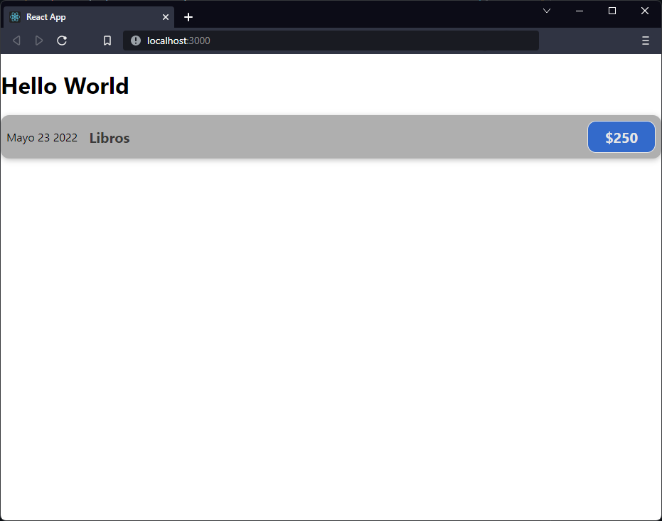

[`React`](../../README.md) > [`Sesión 01: Fundamentos de React`](../Readme.md) > `Ejemplo 1: Componentes`

---

## Ejemplo 01: Componentes

### Objetivos

- Utilizar la sintaxis JSX para construir componentes de React

### Desarrollo

Empecemos por crear un nuevo archivo dentro de la carpeta `components`, este archivo lo nombraremos `ExpenseItem.js`. En React podemos nombrar los archivos como queramos pero es una convención empezar cada palabra con mayúscula. En `ExpenseItem.js` agregamos el siguiente código:

```jsx
function ExpenseItem() {
  return (
    <div>
      <div>Mayo 23 2022</div>
      <div>
        <h2>Libros</h2>
        <div>$250</div>
      </div>
    </div>
  );
}

export default ExpenseItem;
```

En React los componentes deben retornar un sólo elemento, por eso envolvemos todo en un `<div>`, más adelante veremos más a detalle por qué y qué alternativas tenemos. Este componente que acabamos de crear contiene tres elementos, la fecha del gasto, el concepto y el monto. Para poder usarlo debemos importarlo en nuestro componente principal `App.js`:

```jsx
import ExpenseItem from "./ExpenseItem";

function App() {
  return (
    <div>
      <h1>Hello World</h1>
      <ExpenseItem />
    </div>
  );
}

export default App;
```

Escribimos `<ExpenseItem />` en lugar de `<ExpenseItem></ExpenseItem>` porque en JSX los componentes que no llevan nada dentro se pueden cerrar solos. Vamos a crear un archivo más dentro de la carpeta `components` y la llamaremos `ExpenseItem.css`, aquí agregaremos los siguientes estilos:

```css
.expense-item {
  display: flex;
  justify-content: space-between;
  align-items: center;
  box-shadow: 0 2px 8px rgba(0, 0, 0, 0.25);
  padding: 0.5rem;
  margin: 1rem 0;
  border-radius: 12px;
  background-color: #afafaf;
}

.expense-item-description {
  display: flex;
  flex-direction: column;
  gap: 1rem;
  align-items: flex-end;
  flex-flow: column-reverse;
  justify-content: flex-start;
  flex: 1;
}

.expense-item h2 {
  color: #3a3a3a;
  font-size: 1rem;
  flex: 1;
  margin: 0 1rem;
}

.expense-item-price {
  font-size: 1rem;
  font-weight: bold;
  color: #e5e5e5;
  background-color: #336acb;
  border: 1px solid #e5e5e5;
  padding: 0.5rem;
  border-radius: 12px;
}

@media (min-width: 580px) {
  .expense-item-description {
    flex-direction: row;
    align-items: center;
    justify-content: flex-start;
    flex: 1;
  }

  .expense-item-description h2 {
    font-size: 1.25rem;
  }

  .expense-item-price {
    font-size: 1.25rem;
    padding: 0.5rem 1.5rem;
  }
}
```

Recuerda que internamente Create React App utiliza Webpack por lo que es necesario indicarle que queremos incluir este archivo de CSS que acabamos de crear. Para esto vamos a hacer los siguientes cambios en `ExpenseItem.js`:

```jsx
import "./ExpenseItem.css";

function ExpenseItem() {
  return (
    <div className="expense-item">
      <div>Mayo 23 2022</div>
      <div className="expense-item-description">
        <h2>Libros</h2>
        <div className="expense-item-price">$250</div>
      </div>
    </div>
  );
}

export default ExpenseItem;
```

En HTML usamos `class` para definir una clase de CSS, sin embargo, recuerda que estamos trabajando con JavaScript y en este lenguaje `class` es una palabra reservada, es por ello que para usar clases de CSS debemos usar `className`.

Ahora tenemos un componente con más forma y algunos estilos, con todos estos cambios nuestra aplicación se ve de la siguiente manera:


