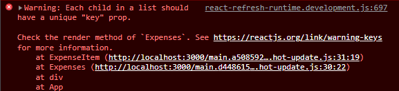

[`React`](../../README.md) > [`Sesión 01: Fundamentos de React`](../Readme.md) > `Ejemplo 04`

---

## Ejemplo 04

React puede renderizar múltiples componentes que se encuentren dentro de un arreglo. Vamos a aprovechar esto y usaremos el método [`map`](https://developer.mozilla.org/es/docs/Web/JavaScript/Reference/Global_Objects/Array/map) para construir un arreglo de componentes con todos los elementos de `expenses`.

```jsx
import ExpenseItem from "./ExpenseItem";
import Card from "../UI/Card";
import "./Expenses.css";

function Expenses(props) {
  return (
    <Card className="expenses">
      {props.items.map((expense) => (
        <ExpenseItem
          date={expense.date}
          title={expense.title}
          amount={expense.amount}
        />
      ))}
    </Card>
  );
}

export default Expenses;
```

De esta manera no necesitamos repetir `<ExpenseItem />` una y otra vez. Esto nos será muy útil cuando vayamos a agregar nuevos gastos a la lista. Si inspeccionamos la consola del navegador vamos a encontrar el siguiente error:



Cuando trabajamos con listas de esta manera debemos darle un identificador único a cada elemento, esto es porque React necesita saber qué elemento debe renderizar nuevamente cuando hayan cambios en el state. Para esto agregaremos el prop `key` y le pasaremos la propiedad `id` que agregamos a nuestro arreglo de gastos.

```jsx
import ExpenseItem from "./ExpenseItem";
import Card from "../UI/Card";
import "./Expenses.css";

function Expenses(props) {
  return (
    <Card className="expenses">
      {props.items.map((expense) => (
        <ExpenseItem
          key={expense.id}
          date={expense.date}
          title={expense.title}
          amount={expense.amount}
        />
      ))}
    </Card>
  );
}

export default Expenses;
```

Si revisamos de nuevo la consola ya no debería de aparecer el error.
