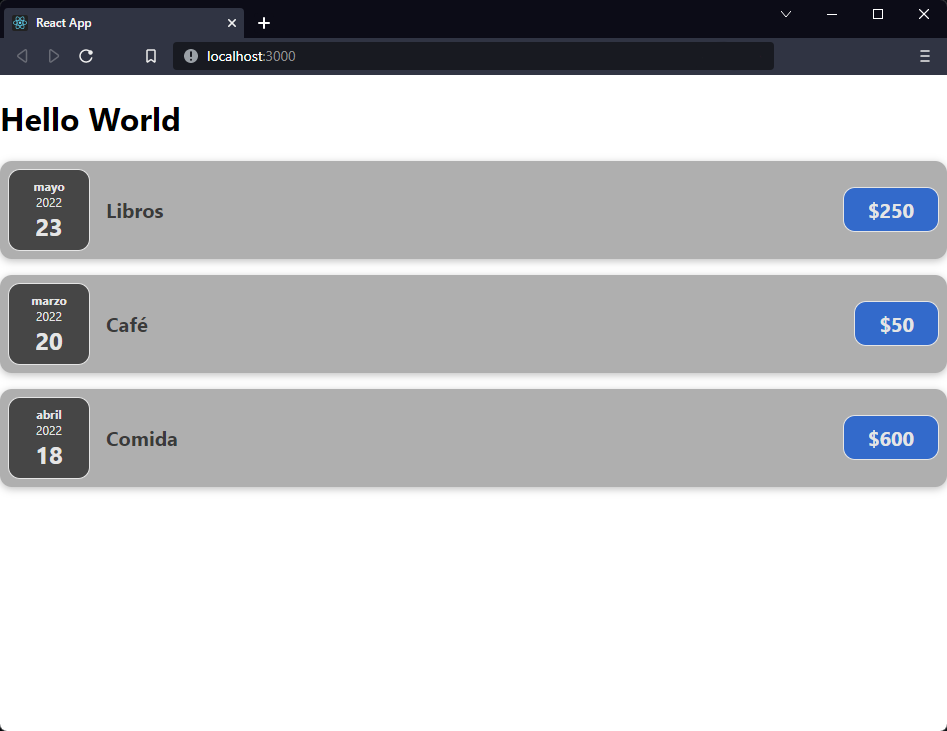

[`React`](../../README.md) > [`Sesión 01: Fundamentos de React`](../Readme.md) > `Reto 01: Props`

---

## Reto 01: Props

### Objetivos

- Utilizar la sintaxis JSX para construir componentes de React
- Construir componentes y pasar datos entre ellos mediante props

### Desarrollo

1. Crear un nuevo componente `ExpenseDate`.

2. Crear `ExpenseDate.css` y agregar los siguientes estilos:

```css
.expense-date {
  display: flex;
  flex-direction: column;
  width: 5rem;
  height: 5rem;
  border: 1px solid #e5e5e5;
  background-color: #464646;
  color: #e5e5e5;
  border-radius: 12px;
  align-items: center;
  justify-content: center;
}

.expense-date-month {
  font-size: 0.75rem;
  font-weight: bold;
}

.expense-date-year {
  font-size: 0.75rem;
}

.expense-date-day {
  font-size: 1.5rem;
  font-weight: bold;
}
```

3. La fecha que estamos usando es un objeto `Date` por lo que podemos usar métodos para extraer el mes, día y año. En `ExpenseDate` debes separar la fecha y usar los estilos del paso 2.

4. Importar `ExpenseDate` en `ExpenseItem` y reemplazar la fecha que se está usando en ese componente.



---

[Solución](./Solucion/Readme.md)
