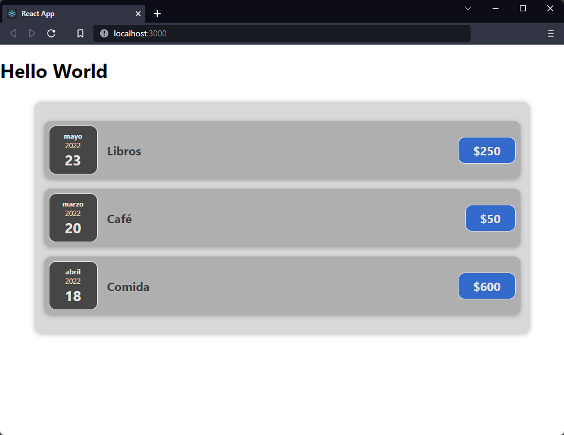

[`React`](../../README.md) > [`Sesión 01: Fundamentos de React`](../Readme.md) > `Reto 02: Props`

---

## Reto 02: Props

1. Crear un nuevo componente `Expenses`.

2. Crear `Expenses.css` y agregar los siguientes estilos:

```css
.expenses {
  padding: 1rem;
  background-color: rgba(215, 215, 215, 0.95);
  margin: 2rem auto;
  width: 50rem;
  max-width: 95%;
  border-radius: 12px;
  box-shadow: 0 1px 8px rgba(0, 0, 0, 0.25);
}
```

3. Dentro de `App` tenemos nuestro arreglo de `expenses` y renderizamos varias veces el componente `ExpenseItem`. En `App` se debe importar `Expenses`, y este último debe contener `ExpenseItem`. **Importante:** Dejar el arreglo `expenses` en `App`.

4. Usar los estilos del paso 2.



---

[Solución](./Solucion/Readme.md)
