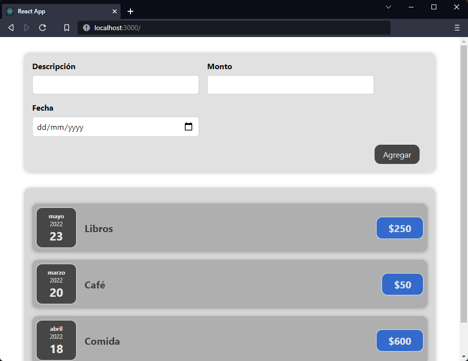

[`React`](../../README.md) > [`Sesión 02: React State y Eventos`](../Readme.md) > `Ejemplo 01: Event Handlers`

---

## Ejemplo 01: Event Handlers

### Objetivos

- Controlar las interacciones del usuario mediante _event handlers_

### Desarrollo

El componente `NewExpense` será el contenedor de nuestro formulario:

```jsx
import Card from "../UI/Card";
import ExpenseForm from "./ExpenseForm";
import "./NewExpense.css";

function NewExpense() {
  return (
    <Card className="new-expense">
      <ExpenseForm />
    </Card>
  );
}

export default NewExpense;
```

Agregamos los estilos de `NewExpense`:

```css
.new-expense {
  background-color: rgba(215, 215, 215, 0.75);
  padding: 1rem;
  margin: 2rem auto;
  width: 50rem;
  max-width: 95%;
}

.new-expense button {
  font: inherit;
  cursor: pointer;
  padding: 0.5rem 1rem;
  border: 1px solid #464646;
  background-color: #464646;
  color: #e5e5e5;
  border-radius: 12px;
  margin-right: 1rem;
}

.new-expense button:hover,
.new-expense button:active {
  background-color: #afafaf;
  border-color: #afafaf;
  color: black;
}
```

Nuestro formulario tendrá 3 inputs, uno para la descripción del gasto, otro para el monto y el último para la fecha, también crearemos un botón para agregar los gastos. Vamos a colocar el siguiente código en `ExpenseForm`:

```jsx
import "./ExpenseForm.css";

function ExpenseForm() {
  return (
    <form>
      <div className="new-expense-controls">
        <div className="new-expense-control">
          <label>Descripción</label>
          <input type="text" />
        </div>
        <div className="new-expense-control">
          <label>Monto</label>
          <input type="number" min="1" step="1" />
        </div>
        <div className="new-expense-control">
          <label>Fecha</label>
          <input type="date" min="2019-01-01" max="2022-12-31" />
        </div>
      </div>
      <div className="new-expense-actions">
        <button type="submit">Agregar</button>
      </div>
    </form>
  );
}

export default ExpenseForm;
```

Agregamos los estilos de `ExpenseForm`:

```css
.new-expense-controls {
  display: flex;
  flex-wrap: wrap;
  gap: 1rem;
  margin-bottom: 1rem;
  text-align: left;
}

.new-expense-control label {
  font-weight: bold;
  margin-bottom: 0.5rem;
  display: block;
}

.new-expense-control input {
  font: inherit;
  padding: 0.5rem;
  border-radius: 6px;
  border: 1px solid #ccc;
  width: 20rem;
  max-width: 100%;
}

.new-expense-actions {
  text-align: right;
}
```

Para poder ver lo que hemos hecho hasta ahora solo nos falta reemplazar el mensaje "Hello World" que tenemos en `App` por nuestro componente `NewExpense`.



Si haces click en el botón `Agregar` te darás cuenta que la página se vuelve a cargar y la aplicación de React se reinicia. Esto se debe a que el comportamiento por defecto de los formularios en HTML es llevar al usuario a otra página. Vamos a agregar un event handler de tipo submit al formulario y evitaremos que la página cargue de nuevo.

```jsx
import "./ExpenseForm.css";

function ExpenseForm() {
  const submitHandler = (event) => {
    event.preventDefault();
  };

  return (
    <form onSubmit={submitHandler}>
      <div className="new-expense-controls">
        <div className="new-expense-control">
          <label>Descripción</label>
          <input type="text" />
        </div>
        <div className="new-expense-control">
          <label>Monto</label>
          <input type="number" min="1" step="1" />
        </div>
        <div className="new-expense-control">
          <label>Fecha</label>
          <input type="date" min="2019-01-01" max="2022-12-31" />
        </div>
      </div>
      <div className="new-expense-actions">
        <button type="submit">Agregar</button>
      </div>
    </form>
  );
}

export default ExpenseForm;
```

Recuerda que en JSX debemos usar `onSubmit` y no `onsubmit`, además debemos de proporcionarle una referencia a la función y no ejecutar la función. Si usamos `onSubmit={submitHandler()}` estamos ejecutando `submitHandler()` inmediatamente y no cuando demos click en el botón agregar.

Por último, `event` es un evento sintético de React, es una instancia de **SyntheticEvent** y cuenta con los mismos métodos de los eventos nativos de JavaScript como `preventDefault()`. Este método como su nombre lo indica evita el comportamiento que tiene un nodo por defecto, en este caso evita que el formulario intente llevar al usuario a otro sitio ocasionando que la aplicación completa se reinicie.
