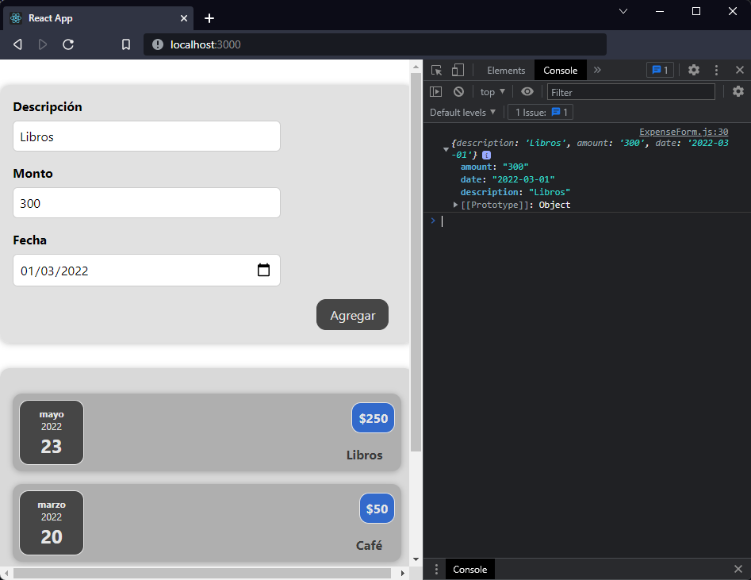

[`React`](../../README.md) > [`Sesión 02: React State y Eventos`](../Readme.md) > `Ejemplo 02: useState hook`

---

## Ejemplo 02: useState hook

### Objetivos

- Manipular el State de un componente mediante el hook useState
- Emplear el State con el input de un usuario

### Desarrollo

Ya que todos los inputs de nuestro formulario cuentan con un event handler podemos guardar los valores de cada input en variables de estado utilizando el hook `useState`.

Lo primero es importar `useState`. La primera variable que vamos a crear será para el input de descripción y la inicializaremos con un string vacío:

```jsx
import { useState } from "react";
import "./ExpenseForm.css";

function ExpenseForm() {
  const [title, setTitle] = useState("");

  ...
```

Ahora en el handler del reto 1 vamos a reemplazar el `console.log` por `setTitle` para actualizar nuestro nuevo state:

```jsx
import { useState } from "react";
import "./ExpenseForm.css";

function ExpenseForm() {
  const [title, setTitle] = useState("");

  const titleChangeHandler = (event) => {
   setTitle(event.target.value);
  };

  ...
```

Con este cambio nuestro input ya puede actualizar el state con la información que proporcione el usuario, sin embargo, nos falta asegurarnos de poder actualizar el input si el state cambia, esto es **two-way binding**.

```jsx
<div className="new-expense-control">
  <label>Descripción</label>
  <input type="text" value={title} onChange={titleChangeHandler} />
</div>
```

Hacemos lo mismo con los otros dos inputs:

```jsx
import { useState } from "react";
import "./ExpenseForm.css";

function ExpenseForm() {
  const [title, setTitle] = useState("");
  const [amount, setAmount] = useState("");
  const [date, setDate] = useState("");

  const titleChangeHandler = (event) => {
    setTitle(event.target.value);
  };

  const amountChangeHandler = (event) => {
    setAmount(event.target.value);
  };

  const dateChangeHandler = (event) => {
    setDate(event.target.value);
  };

  const submitHandler = (event) => {
    event.preventDefault();
  };

  return (
    <form onSubmit={submitHandler}>
      <div className="new-expense-controls">
        <div className="new-expense-control">
          <label>Descripción</label>
          <input type="text" value={title} onChange={titleChangeHandler} />
        </div>
        <div className="new-expense-control">
          <label>Monto</label>
          <input
            type="number"
            min="1"
            step="1"
            value={amount}
            onChange={amountChangeHandler}
          />
        </div>
        <div className="new-expense-control">
          <label>Fecha</label>
          <input
            type="date"
            min="2019-01-01"
            max="2022-12-31"
            value={date}
            onChange={dateChangeHandler}
          />
        </div>
      </div>
      <div className="new-expense-actions">
        <button type="submit">Agregar</button>
      </div>
    </form>
  );
}

export default ExpenseForm;
```

El útimo cambio que haremos será en la función `submitHandler`, vamos a crear un objeto `expense` con todas nuestras variables de estado e imprimiremos dicho objeto en consola. Más adelante lo usaremos para agregar nuevos gastos a nuestra lista.

```jsx
const submitHandler = (event) => {
  event.preventDefault();

  const expense = {
    title,
    amount,
    date,
  };

  console.log(expense);
};
```


