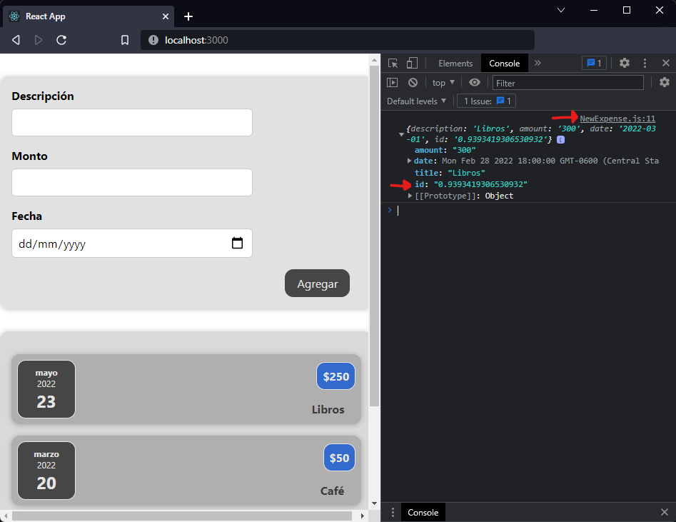

[`React`](../../README.md) > [`Sesión 02: React State y Eventos`](../Readme.md) > `Ejemplo 04: Comunicación hijo a padre`

---

## Ejemplo 04: Comunicación hijo a padre

La información de `ExpenseForm` debe pasar primero por `NewExpense` antes de poder llegar a `App`. Recuerda que no podemos saltarnos componentes. Empecemos con `NewExpense`.

```jsx
function NewExpense() {
  const saveExpense = (expense) => {
    const newExpense = {
      ...expense,
      id: Math.random().toString(),
    };
    console.log(newExpense);
  };

  return (
    <Card className="new-expense">
      <ExpenseForm onSaveExpense={saveExpense} />
    </Card>
  );
}
```

Creamos una función `saveExpense` que recibe un objeto `expense` con los datos que ingresó el usuario. Estamos armando un nuevo objeto al que le agregamos un `id` igual a como lo hacemos en `App`, recuerda que los elementos de las listas deben tener un id único. Por ahora vamos a imprimir este nuevo objeto en consola, lo siguiente es pasar esta función nueva a `ExpenseForm` y lo haremos a través del prop `onSaveExpense`.

```jsx
const submitHandler = (event) => {
  event.preventDefault();

  const expense = {
    title,
    amount,
    date: new Date(date),
  };

  props.onSaveExpense(expense);

  setTitle("");
  setAmount("");
  setDate("");
};
```

Ahora en `ExpenseForm` modificamos la función `submitHandler` para ejecutar `onSaveExpense`, también actualizamos todas nuestras variables de estado para que se limpien los inputs y modificamos `date` para que sea un objeto `Date` de JavaScript.



Enseguida notamos que el mensaje en consola viene de `NewExpense` y no de `ExpenseForm`, también contiene el `id` que acabamos de agregar y los inputs se limpian depués de hacer click en el botón `Agregar`.

Ya estamos listos para llevar la información de los gastos hasta `App`. Este componente requiere de más ajustes:

1. Vamos a agregar un state para los gastos.
2. Crearemos un handler que se encargará de agregar los gastos al state.
3. Enviaremos este handler a `NewExpense` a través de un prop.

```jsx
function App() {
  const [expenses, setExpenses] = useState([]);

  const addExpenseHandler = (expense) => {
    setExpenses((prevState) => [expense, ...prevState]);
  };

  return (
    <div>
      <NewExpense onAddExpense={addExpenseHandler} />
      <Expenses items={expenses} />
    </div>
  );
}
```

¡Listo! Ya podemos agregar nuevos gastos en nuestra aplicación. No te preocupes por el card vacío que sale al cargar la aplicación, corregiremos ese detalle más adelante.

Si lo necesitas puedes revisar el código completo que llevamos hasta ahora:

### [`App.js`](./components/App.js)

### [`NewExpense.js`](./components/NewExpense.js)

### [`ExpenseForm.js`](./components/ExpenseForm.js)
