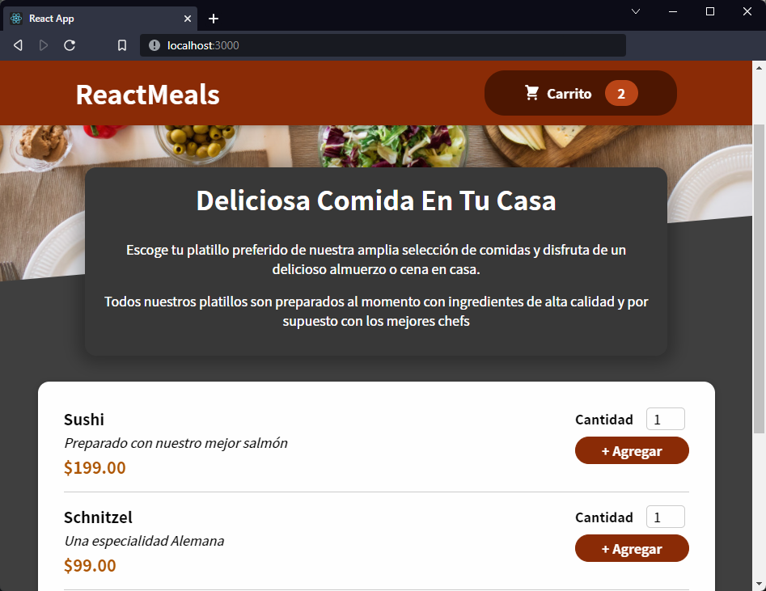

[`React`](../../README.md) > [`Sesión 02: React State y Evento`](../Readme.md) > `Postwork`

---

# Postwork

## 🎯 Objetivos

- Manejar eventos de React
- Utilizar el hook useState para manipular el estado

## 🛠 Desarrollo

En la sesión anterior creaste la estructura inicial de `ReactMeals`, agregaste algunos estilos y renderizaste platillos del menú. Con lo visto en esta sesión estás listo para manejar eventos y manipular el state para agregar elementos al carrito de compra.

- Crear un componente `Cart`. Por el momento sólo es necesario mostrar el número de elementos agregados al carrito, más adelante aprenderás lo necesario para mostrar el detalle del carrito en un modal.
- Si aún no lo has hecho, agrega un botón de `Agregar` a cada platillo del menú junto con un input que permita al usuario cambiar la cantidad.
- Crea los event handlers necesarios para estos nuevos elementos (input y botón).
- Utiliza el hook `useState` para manipular las cantidades del carrito de compras.

### Imágen de referencia

Recuerda que el diseño de la aplicación es a tu gusto, por lo que los colores y el acomodo de los elementos está completamente a tu criterio. A continuación te mostramos una imágen que te servirá como referencia de lo que llevamos hasta el momento:

