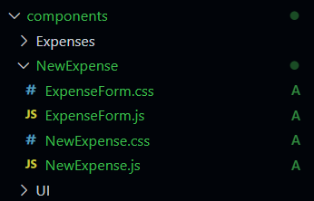

[`React`](../README.md) > `Sesión 02: React State y Eventos`

---

# Sesión 02 - React State y Eventos

## 🎯 Objetivos

- Manejar eventos en React
- Manipular el State de un componente mediante el hook useState
- Actualizar el State con el input de un usuario

## 🛠 Contenido

### Event Handlers

En la sesión anterior creamos nuestra aplicación de gastos y agregamos una lista de elementos, sin embargo, esta lista no es dinámica. En esta sesión agregaremos nuevos elementos a nuestra lista de gastos y nos apoyaremos de eventos para esto. Los componentes de React manejan eventos de una manera muy similar a como lo hacemos con nodos del DOM cuando usamos JavaScript.

Para ver este tema vamos a empezar creando una nueva carpeta dentro de `components` y la vamos a llamar `NewExpense`, en esta carpeta irán todos los componentes necesarios para crear un formulario que nos permita agregar nuevos gastos. Vamos a crear dos componentes en esta carpeta, `NewExpense` y `ExpenseForm` junto con sus respectivos archivos CSS.

- [`Ejemplo 01: Event Handlers`](./Ejemplo-01/Readme.md)

- [`Reto 01: Event Handlers`](./Reto-01/Readme.md)

### State y useState hook

Ya vimos cómo usar los props para pasar información entre componentes y hacerlos dinámicos. El state es similar a los props en el sentido que contienen la información que el componente necesita, pero difiere de los props porque el state es privado y el componente es el que tiene el control. Cada componente es independiente y tiene su propio state.

Como estamos trabajando con componentes funcionales usaremos el hook useState, recuerda que inicialmente el state era exclusivo de las clases. Los hooks son funciones especiales que permiten a los componentes usar características de las clases como el state.

- [`Ejemplo 02: useState hook`](./Ejemplo-02/Readme.md)

- [`Ejemplo 03: prevState`](./Ejemplo-03/Readme.md)

### Comunicación de componente hijo a padre

Nuestro componente `ExpenseForm` ya cuenta con state y es capaz de actualizarlo con la información que proporcione el usuario. Ahora necesitamos que esa información llegue varios niveles arriba hasta el componente `App` que es donde tenemos la lista `expenses`. ¿Cómo hacemos esto si antes dijimos que la información fluye de componentes padres a hijos? De la misma forma, usando `props`. Así como pasamos strings, arreglos u objetos a través de los `props`, también podemos pasar referencias a funciones. Veamos cómo hacerlo un nivel a la vez.

- [`Ejemplo 04: Comunicación hijo a padre`](./Ejemplo-04/Readme.md)

### Renderizado condicional

El renderizado condicional se referie a mostrar cierto contenido u otro dependiendo de si una condición se cumple o no. En nuestra aplicación por ejemplo, un buen uso sería en la lista de gastos, si tenemos gastos se renderizan pero si no tenemos gastos podemos mostrar un mensaje alternativo.

- [`Reto 02: Renderizado condicional`](./Reto-02/Readme.md)

## 📝 Postwork
