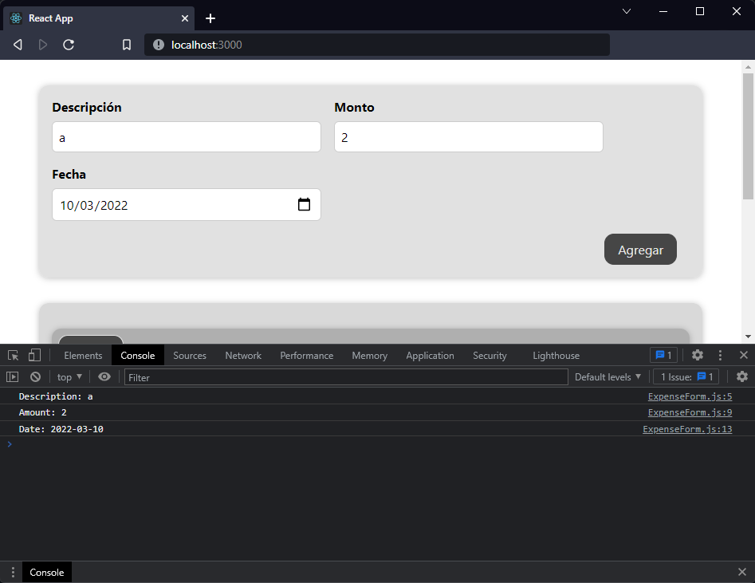

[`React`](../../README.md) > [`Sesión 02: React State y Eventos`](../Readme.md) > `Reto 01: Event Handlers`

---

## Reto 01: Event Handlers

1. Agrega un event listener a cada `input` del componente `ExpenseForm`.

2. Imprimir en consola el valor ingresado por el usuario en cada `input`.

---

[Solución](./Solucion/Readme.md)
