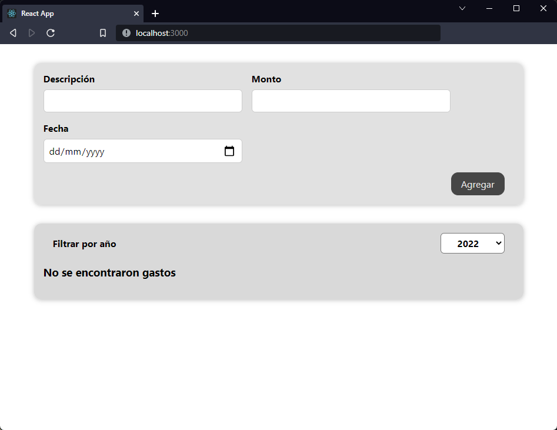

[`React`](../../README.md) > [`Sesión 02: React State y Eventos`](../Readme.md) > `Reto 02: Renderizado Condicional`

---

## Reto 02: Renderizado Condicional

1. Dentro de la carpeta expenses crear un nuevo componente `ExpensesFilter` y agregar el siguiente código:

```jsx
import "./ExpensesFilter.css";

function ExpensesFilter() {
  return (
    <div className="expenses-filter">
      <div className="expenses-filter-control">
        <label>Filtrar por año</label>
        <select>
          <option value="2022">2022</option>
          <option value="2021">2021</option>
          <option value="2020">2020</option>
          <option value="2019">2019</option>
        </select>
      </div>
    </div>
  );
}

export default ExpensesFilter;
```

2. En la misma carpeta crear el archivo `ExpensesFilter.css` y agregar los siguientes estilos:

```css
.expenses-filter {
  padding: 0 1rem;
}

.expenses-filter-control {
  display: flex;
  width: 100%;
  align-items: center;
  justify-content: space-between;
}

.expenses-filter label {
  font-weight: bold;
}

.expenses-filter select {
  font: inherit;
  padding: 0.3rem 1.5rem;
  font-weight: bold;
  border-radius: 6px;
}
```

3. Importar `ExpensesFilter` en `Expenses` y renderizarlo dentro de `<Card>` justo antes de la lista de gastos.

4. Agregar state en `Expenses` para guardar el año, inicializarlo con el string `'2022'`.

5. Crear un handler para actualizar el state del paso anterior.

6. Crear una función que filtre los gastos por año. Esta función debe crear un nuevo arreglo en lugar de modificar el existente.

7. Pasar tanto el handler como el año al nuevo componente `ExpensesFilter`, recuerda lo que vimos sobre two-way binding.

8. Si el nuevo arreglo no contiene gastos mostrar el mensaje `No se encontraron gastos`, en caso contrario mostrar los gastos filtrados por año.



---

[Solución](./Solucion/Readme.md)
