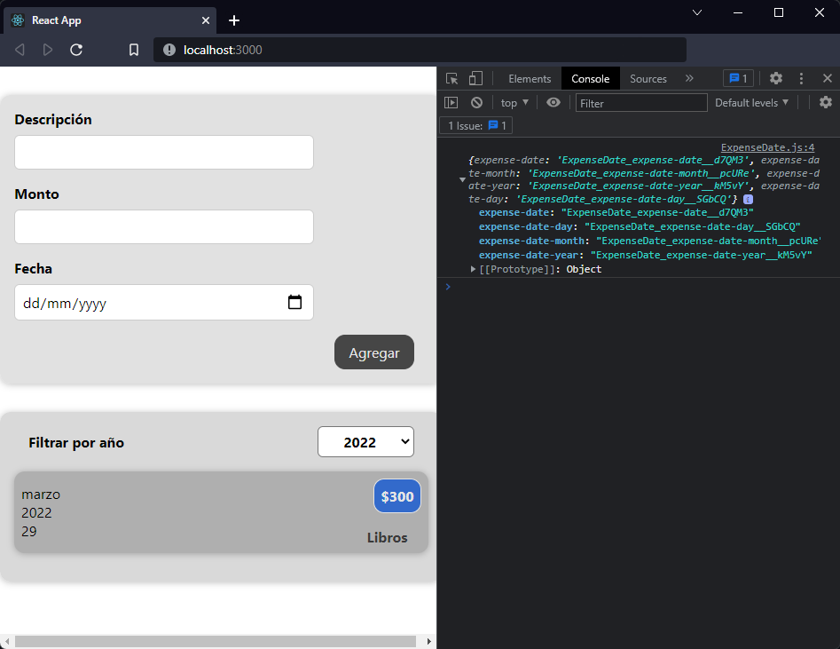
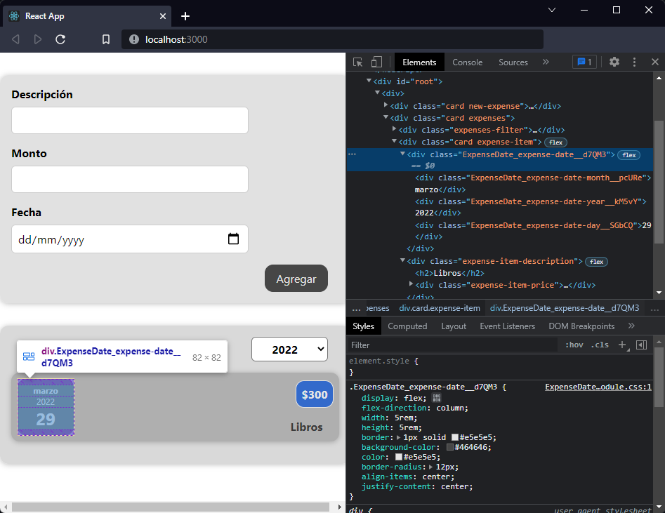

[`React`](../../README.md) > [`Sesión 03: Trabajando con estilos`](../Readme.md) > `Ejemplo 01: Módulos de CSS`

---

## Ejemplo 01: Módulos de CSS

### Objetivos

- Utilizar CSS Modules para estilizar componentes

### Desarrollo

Empecemos con un componente pequeño, vamos a usar módulos de CSS en `ExpenseDate` y para ello debemos cambiar el nombre del CSS de `ExpanseDate.css` a `ExpenseDate.module.css`. Tambien debemos cambar la forma en la que estamos importando este archivo:

```jsx
import styles from "./ExpenseDate.module.css";
```

Esto nos crea un objeto `styles` cuyas propiedades corresponden a cada una de las clases que tenemos en nuestro CSS.



Aquí vemos que la propiedad es el nombre de la clase, y el valor es la misma clase pero incluye información que no agregamos nosotros como el nombre del componente y un hash al final. Para usar estas nuevas clases sólo hay que cambiar la propiedad `className`:

```jsx
import styles from "./ExpenseDate.module.css";

function ExpenseDate(props) {
  const month = props.date.toLocaleString("es-MX", { month: "long" });
  const day = props.date.toLocaleString("es-MX", { day: "2-digit" });
  const year = props.date.getFullYear();

  return (
    <div className={styles["expense-date"]}>
      <div className={styles["expense-date-month"]}>{month}</div>
      <div className={styles["expense-date-year"]}>{year}</div>
      <div className={styles["expense-date-day"]}>{day}</div>
    </div>
  );
}

export default ExpenseDate;
```

> No tiene que ser `styles`, puedes obtar por darle otro nombre a la variable.

Estamos accediendo a las propiedades del objeto `styles` como si fuera un objeto porque nuestra clase de css está en kebab-case, pero si fuera una sola palabra podríamos usar `styles.expense`.



El resultado final es el mismo con el que empezamos visualmente, pero internamente estamos garantizando que el nombre de las clases que estamos usando en este componente no se va a repetir en otro. Esto significa que podríamos usar `expense-date` en un componente distinto sin tener conflictos entre clases.
