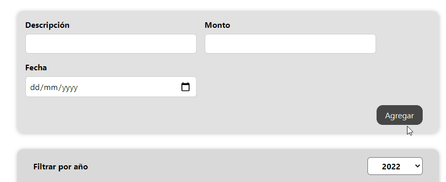

[`React`](../../README.md) > [`Sesión 03: Trabajando con estilos`](../Readme.md) > `Ejemplo 02: Estilos dinámicos con CSS Modules`

---

## Ejemplo 02: Estilos dinámicos con CSS Modules

### Objetivos

- Utilizar CSS Modules para estilizar componentes de forma dinámica

### Desarrollo

Con estilos dinámicos nos referimos a cambiar, agregar o quitar clases de CSS dependiendo de cierta condición. Para este ejemplo vamos a modificar un componente diferente, haremos lo mismo que hicimos en el ejemplo anterior pero con `ExpenseForm`:

1. Renombrar `ExpenseForm.css` por `ExpenseForm.module.css`
2. Importar `styles` de `./ExpenseForm.module.css`
3. Reemplazar los strings de cada `className` por la propiedad de `styles` que le corresponda.

```jsx
import { useState } from "react";
import styles from "./ExpenseForm.module.css";

function ExpenseForm(props) {
  const [title, setTitle] = useState("");
  const [amount, setAmount] = useState("");
  const [date, setDate] = useState("");

  const titleChangeHandler = (event) => {
    setTitle(event.target.value);
  };

  const amountChangeHandler = (event) => {
    setAmount(event.target.value);
  };

  const dateChangeHandler = (event) => {
    setDate(event.target.value);
  };

  const submitHandler = (event) => {
    event.preventDefault();

    const expense = {
      title,
      amount,
      date: new Date(date),
    };

    props.onSaveExpense(expense);

    setTitle("");
    setAmount("");
    setDate("");
  };

  return (
    <form onSubmit={submitHandler}>
      <div className={styles["new-expense-controls"]}>
        <div className={styles["new-expense-control"]}>
          <label>Descripción</label>
          <input type="text" value={title} onChange={titleChangeHandler} />
        </div>
        <div className={styles["new-expense-control"]}>
          <label>Monto</label>
          <input
            type="number"
            min="1"
            step="1"
            value={amount}
            onChange={amountChangeHandler}
          />
        </div>
        <div className={styles["new-expense-control"]}>
          <label>Fecha</label>
          <input
            type="date"
            min="2019-01-01"
            max="2022-12-31"
            value={date}
            onChange={dateChangeHandler}
          />
        </div>
      </div>
      <div className={styles["new-expense-actions"]}>
        <button type="submit">Agregar</button>
      </div>
    </form>
  );
}

export default ExpenseForm;
```

Ahora en `ExpenseForm.module.css` agregamos los siguientes estilos:

```css
.new-expense-control.invalid input {
  border-color: #ad0000;
}

.new-expense-control.invalid label {
  color: #ad0000;
}
```

Volvamos a `ExpenseForm`, necesitamos una nueva variable de estado que usaremos para determinar si un input del formulario es válido o no:

```jsx
const [isValid, setIsValid] = useState(true);
```

Nuestro estado inicial es `true`. Este va a cambiar a `false` si el input de descripción se encuentra vacío, esta validación la podemos hacer en `submitHandler`:

```jsx
const submitHandler = (event) => {
  event.preventDefault();

  if (title.trim().length === 0) {
    setIsValid(false);
    return;
  }

  const expense = {
    title,
    amount,
    date: new Date(date),
  };

  props.onSaveExpense(expense);

  setTitle("");
  setAmount("");
  setDate("");
};
```

> El método `trim()` elimina los espacios en blanco de ambos lados de un string.

El `if` que acabamos de colocar está evaluando la longitud de `title`, si recibimos un string vacío, es decir, que el usuario no ha ingresado nada o ha ingresado espacios en blanco, cambiamos `isValid` a `false` y nos salimos de la función para evitar que se agregue el gasto a la lista. Sólo nos falta usar la nueva clase que hicimos:

```jsx
<div
  className={`${styles["new-expense-control"]} ${!isValid && styles.invalid}`}
>
  <label>Descripción</label>
  <input type="text" value={title} onChange={titleChangeHandler} />
</div>
```

Cambiamos a un template string para que podamos usar una expresión de JavaScript, la primera parte es lo que ya teníamos, la clase `new-expense-control`, la segunda parte usa el operador lógico `&&`, evalúa que `isValid` sea `false` y si se cumple esa condición agregamos la clase `invalid`.



Revisa el código completo de este componente:

```jsx
import { useState } from "react";
import styles from "./ExpenseForm.module.css";

function ExpenseForm(props) {
  const [title, setTitle] = useState("");
  const [amount, setAmount] = useState("");
  const [date, setDate] = useState("");
  const [isValid, setIsValid] = useState(true);

  const titleChangeHandler = (event) => {
    setTitle(event.target.value);
  };

  const amountChangeHandler = (event) => {
    setAmount(event.target.value);
  };

  const dateChangeHandler = (event) => {
    setDate(event.target.value);
  };

  const submitHandler = (event) => {
    event.preventDefault();

    if (title.trim().length === 0) {
      setIsValid(false);
      return;
    }

    const expense = {
      title,
      amount,
      date: new Date(date),
    };

    props.onSaveExpense(expense);

    setTitle("");
    setAmount("");
    setDate("");
  };

  return (
    <form onSubmit={submitHandler}>
      <div className={styles["new-expense-controls"]}>
        <div
          className={`${styles["new-expense-control"]} ${
            !isValid && styles.invalid
          }`}
        >
          <label>Descripción</label>
          <input type="text" value={title} onChange={titleChangeHandler} />
        </div>
        <div className={styles["new-expense-control"]}>
          <label>Monto</label>
          <input
            type="number"
            min="1"
            step="1"
            value={amount}
            onChange={amountChangeHandler}
          />
        </div>
        <div className={styles["new-expense-control"]}>
          <label>Fecha</label>
          <input
            type="date"
            min="2019-01-01"
            max="2022-12-31"
            value={date}
            onChange={dateChangeHandler}
          />
        </div>
      </div>
      <div className={styles["new-expense-actions"]}>
        <button type="submit">Agregar</button>
      </div>
    </form>
  );
}

export default ExpenseForm;
```
