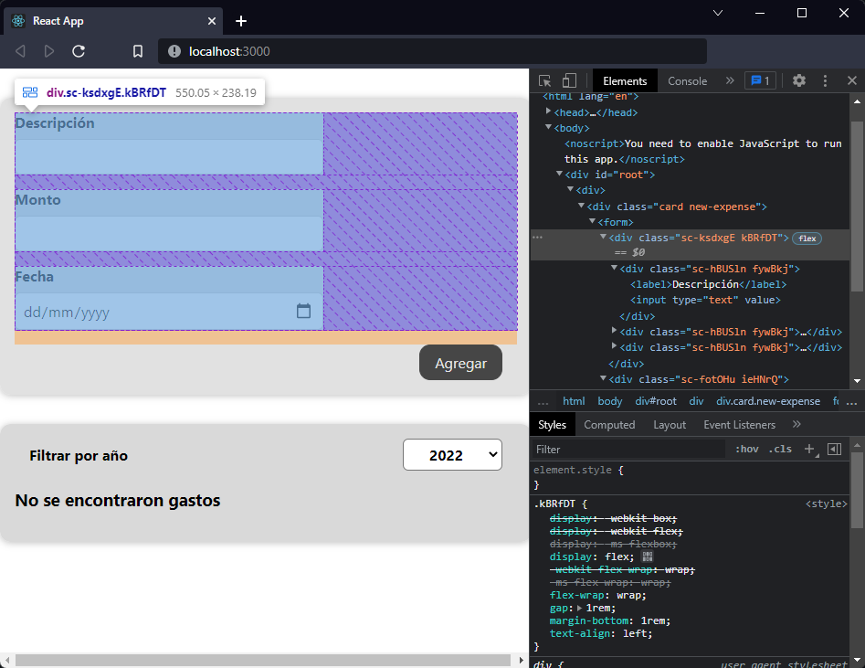

[`React`](../../README.md) > [`Sesión 03: Trabajando con estilos`](../Readme.md) > `Ejemplo 03: Styled Components`

---

## Ejemplo 03: Styled Components

Ahora que ya instalamos la librería `Styled Components` podemos continuar trabajando en el mismo componente del ejemplo anterior `ExpenseForm`. Vamos a eliminar el `import` del módulo de CSS y lo vamos a reemplazar por el de `styled-components`:

```jsx
import styled from "styled-components";
```

Veamos cómo crear un componente estilizado:

```jsx
const FormControls = styled.div``;
```

`FormControls` es un componente de React que renderiza un `div`. Con esta sintaxis podemos generar cualquier tipo de elemento que necesitemos. Los estilos se definen dentro de los backticks sin necesidad de un selector. Copiemos los estilos de la clase `.new-expense-controls`:

```jsx
const FormControls = styled.div`
  display: flex;
  flex-wrap: wrap;
  gap: 1rem;
  margin-bottom: 1rem;
  text-align: left;
`;
```

Haremos lo mismo con los estilos de la clase `.new-expense-actions`:

```jsx
const FormActions = styled.div`
  text-align: right;
`;
```

Sólo nos faltan los estilos de la clase `.new-expense-control` pero este es un poco diferente ya que la clase en sí no tiene estilos, en nuestro CSS estamos dando estilos al `label` y el `input` que se encuentran dentro de `.new-expense-control`. Para obtener el mismo resultado podemos usar `&` y en este caso particular sí necesitamos incluir los selectores:

```jsx
const FormControl = styled.div`
  & label {
    font-weight: bold;
    margin-bottom: 0.5rem;
    display: block;
  }

  & input {
    font: inherit;
    padding: 0.5rem;
    border-radius: 6px;
    border: 1px solid #ccc;
    width: 20rem;
    max-width: 100%;
  }
`;
```

Como dijimos que son componentes de React podemos usarlos dentro de nuestro JSX para reemplazar los `div` que tenemos con clases:

```jsx
return (
  <form onSubmit={submitHandler}>
    <FormControls>
      <FormControl>
        <label>Descripción</label>
        <input type="text" value={title} onChange={titleChangeHandler} />
      </FormControl>
      <FormControl>
        <label>Monto</label>
        <input
          type="number"
          min="1"
          step="1"
          value={amount}
          onChange={amountChangeHandler}
        />
      </FormControl>
      <FormControl>
        <label>Fecha</label>
        <input
          type="date"
          min="2019-01-01"
          max="2022-12-31"
          value={date}
          onChange={dateChangeHandler}
        />
      </FormControl>
    </FormControls>
    <FormActions>
      <button type="submit">Agregar</button>
    </FormActions>
  </form>
);
```

Si inspeccionas los elementos de la aplicación te darás que cuenta que de manera similar a los módulos de CSS, Styled Components genera un hash para cada componente de React que creamos. Esto implica que los estilos son exclusivos del componente y no corremos el riesgo de tener conflictos.


