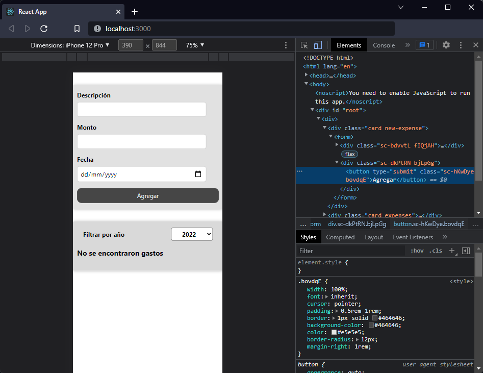

[`React`](../../README.md) > [`Sesión 03: Trabajando con estilos`](../Readme.md) > `Ejemplo 04: Props y media queries`

---

## Ejemplo 04: Props y media queries

En el ejemplo anterior cambiamos los módulos de CSS por Styled Components en `ExpenseForm`. Al hacerlo eliminamos las clases dinámicas que validaban si la descipción del gasto estaba vacía.

Los componentes creados con `styled` también aceptan clases usando `className` por lo que podríamos usar la misma estrategia que usamos anteriormente, sin embargo, podemos pasarle props al componente y usarlos dentro de los backticks cuando definimos los estilos.

Primero agregaremos el prop `invalid` al componente `FormControl`:

```jsx
<FormControl invalid={!isValid}>
  <label>Descripción</label>
  <input type="text" value={title} onChange={titleChangeHandler} />
</FormControl>
```

Ahora usemos este prop para definir el color de borde y del texto de manera dinámica:

```jsx
const FormControl = styled.div`
  & label {
    font-weight: bold;
    margin-bottom: 0.5rem;
    display: block;
    color: ${(props) => (props.invalid ? "#ad0000" : "#000")};
  }

  & input {
    font: inherit;
    padding: 0.5rem;
    border-radius: 6px;
    border: 1px solid ${(props) => (props.invalid ? "#ad0000" : "#ccc")};
    width: 20rem;
    max-width: 100%;
  }
`;
```

Como ya estamos definiendo dinámicamente el color no necesitamos usar la clase `invalid` que teníamos anteriormente. Ahora que nuestro input está listo vamos a crear un nuevo componente para el botón, vamos a eliminar todas las clases del botón que se encuentran en `NewExpense.css` y los estilos los usaremos en el componente:

```jsx
const Button = styled.button`
  font: inherit;
  cursor: pointer;
  padding: 0.5rem 1rem;
  border: 1px solid #464646;
  background-color: #464646;
  color: #e5e5e5;
  border-radius: 12px;
  margin-right: 1rem;
`;
```

Con styled componentes también podemos usar pseudo selectores como `hover` o `active`:

```jsx
const Button = styled.button`
  font: inherit;
  cursor: pointer;
  padding: 0.5rem 1rem;
  border: 1px solid #464646;
  background-color: #464646;
  color: #e5e5e5;
  border-radius: 12px;
  margin-right: 1rem;

  &:hover,
  &:active {
    background-color: #afafaf;
    border-color: #afafaf;
    color: black;
  }
`;
```

Incluso podemos usar media queries para un diseño responsivo:

```jsx
const Button = styled.button`
  font: inherit;
  cursor: pointer;
  padding: 0.5rem 1rem;
  border: 1px solid #464646;
  background-color: #464646;
  color: #e5e5e5;
  border-radius: 12px;
  margin-right: 1rem;
  width: 100%;

  &:hover,
  &:active {
    background-color: #afafaf;
    border-color: #afafaf;
    color: black;
  }

  @media (min-width: 768px) {
    width: auto;
  }
`;
```

> **Nota:** Agregamos `width: 100%` por defecto y usamos `width: auto` en el media query.

Finalmente tenemos un botón que es responsivo y un input que valida si está vacío antes de agregar el gasto a la lista. Todo esto lo logramos dentro del archivo `.js` de nuestro componente sin necesidad de importar un `.css` gracias a la librería styled componentes.


