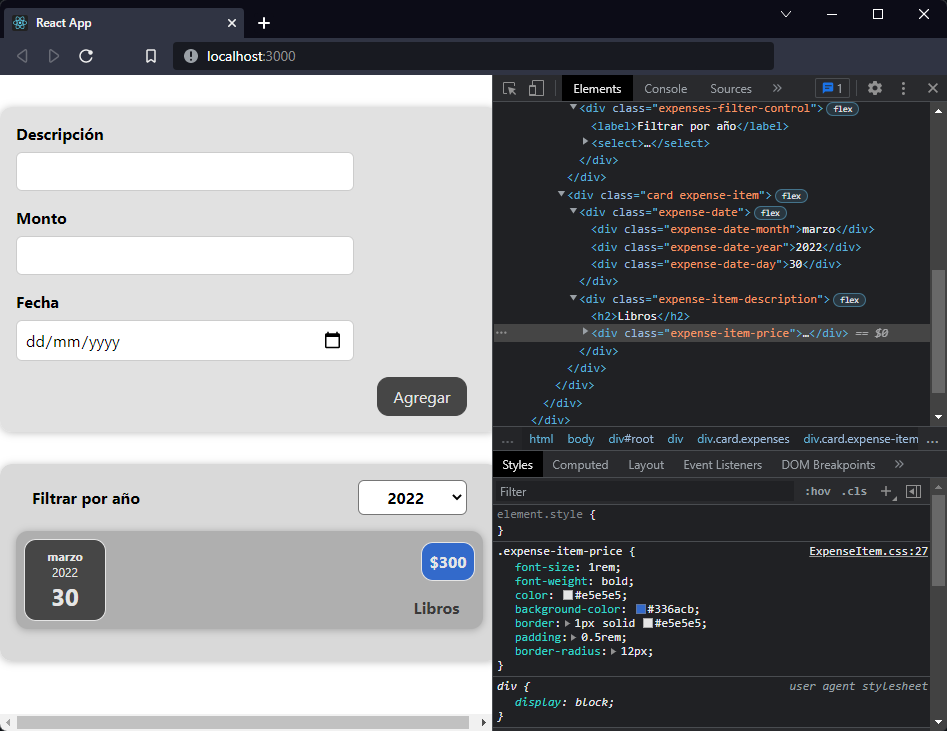

[`React`](../README.md) > `Sesión 03: Trabajando con estilos`

---

# Sesión 03 - Trabajando con estilos

## 🎯 Objetivos

- Diferenciar las distintas formas de estilizar componentes
- Aplicar estilos de forma dinámica
- Utilizar media queries para obtener un diseño responsivo

## 🛠 Contenido

### CSS Modules

Hasta ahora nos hemos enfocado más en la lógica de los componentes y no tanto en los estilos. Cuando importamos un archivo CSS directamente en un componente estamos colocando esos estilos disponibles para todos los componentes de nuestra aplicación, estamos acostumbrados a crear componentes pequeños e independientes por lo que esperaríamos que los estilos también sean únicos para cada componente.



La desventaja de esto es que si usamos el mismo nombre para definir una clase en otro componente vamos a tener conflicto con los estilos. Una solución sería revisar todos los nombres de clases para asegurarnos que no hay duplicados, pero esto no es escalable, entre más crezca la aplicación más difícil será de mantener.

Una alternativa es usar módulos de CSS, como nuestra aplicación la instalamos con [Create React App](https://create-react-app.dev/docs/adding-a-css-modules-stylesheet) no necesitamos configurar nada, ya estamos listos para usar módulos de CSS en nuestros componentes.

- [`Ejemplo 01: Módulos de CSS`](./Ejemplo-01/Readme.md)

- [`Ejemplo 02: Estilos dinámicos con CSS Modules`](./Ejemplo-02/Readme.md)

### Styled Components

Otra alternativa para estilizar componentes es [Styled Components](https://styled-components.com/). Esta es una librería que nos permite crear componentes de React ya estilizados sin necesidad de crear archivos CSS. Es una combinación entre ES6 y CSS ya que los estilos se agregan dentro del componente usando _tagged template literals_.

Como se trata de una librería primero debemos instalarla:

```bash
npm install --save styled-components
```

- [`Ejemplo 03: Styled Components`](./Ejemplo-03/Readme.md)

- [`Ejemplo 04: Props y media queries`](./Ejemplo-04/Readme.md)

> **Nota:** Para poder enfocarnos en la lógica y funcionalidad de React seguiremos usando CSS Modules en los ejemplos y retos, sin embargo, puedes continuar trabajando con Styled Components y explorar la [documentación](https://styled-components.com/docs) para descubrir todo lo que esta librería tiene que ofrecer.

- [`Reto 01: Validaciones`](./Reto-01/Readme.md)
