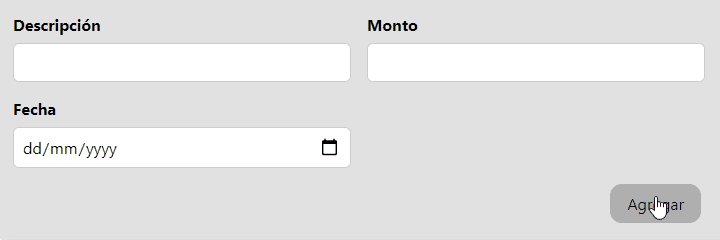

[`React`](../../README.md) > [`Sesión 03: Trabajando con estilos`](../Readme.md) > `Reto 01: Validaciones`

---

## Reto 01: Validaciones

1. Validar los otros dos inputs no estén vacíos. La validación de cada input debe ser independiente, es decir, solamente el input que esté vacío es el que debe marcarse en rojo.

2. Si un input cambia a rojo porque está vacío, debe volver a su estado original una vez que se comience a escribir.

