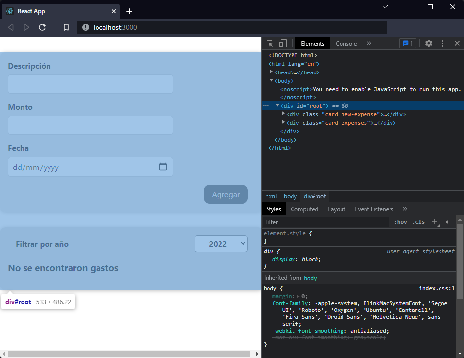

[`React`](../../README.md) > [`Sesión 04: Fragments, Portals y Refs`](../Readme.md) > `Ejemplo 01: React Fragments`

---

## Ejemplo 01: React Fragments

### Objetivos

- Utilizar React Fragments para no renderizar nodos innecesarios

### Desarrollo

Ahora no es un problema pero conforme nuestra aplicación crezca es más fácil introducir más elementos `<div>` innecesarios. React cuenta con un componente especial `Fragment` que no renderiza ningún elemento, sólo retorna el contenido que recibe a través de `props.children`.

```jsx
import { useState } from "react";
import Expenses from "./Expenses/Expenses";
import NewExpense from "./NewExpense/NewExpense";

function App() {
  const [expenses, setExpenses] = useState([]);

  const addExpenseHandler = (expense) => {
    setExpenses((prevState) => [expense, ...prevState]);
  };

  return (
    <div>
      <NewExpense onAddExpense={addExpenseHandler} />
      <Expenses items={expenses} />
    </div>
  );
}

export default App;
```

En distintos recursos como publicaciones en un blog, videos, tutoriales, etc. encontrarás que los fragmentos de React se usan de formas diferentes. Lo más común es declarar explícitamente `React.Fragment`:

```jsx
import React, { useState } from "react";
import Expenses from "./Expenses/Expenses";
import NewExpense from "./NewExpense/NewExpense";

function App() {
  const [expenses, setExpenses] = useState([]);

  const addExpenseHandler = (expense) => {
    setExpenses((prevState) => [expense, ...prevState]);
  };

  return (
    <React.Fragment>
      <NewExpense onAddExpense={addExpenseHandler} />
      <Expenses items={expenses} />
    </React.Fragment>
  );
}

export default App;
```

Cuando usamos fragmentos de esta forma podemos usar el atributo `key` en caso de trabajar con listas, este es el único atributo que recibe el componente `Fragment`. Otra manera es importar `Fragment` directamente:

```jsx
import { useState, Fragment } from "react";
import Expenses from "./Expenses/Expenses";
import NewExpense from "./NewExpense/NewExpense";

function App() {
  const [expenses, setExpenses] = useState([]);

  const addExpenseHandler = (expense) => {
    setExpenses((prevState) => [expense, ...prevState]);
  };

  return (
    <Fragment>
      <NewExpense onAddExpense={addExpenseHandler} />
      <Expenses items={expenses} />
    </Fragment>
  );
}

export default App;
```

También puedes usar fragmentos con una sintaxis mucho más corta, es común verla en tutoriales recientes:

```jsx
import { useState } from "react";
import Expenses from "./Expenses/Expenses";
import NewExpense from "./NewExpense/NewExpense";

function App() {
  const [expenses, setExpenses] = useState([]);

  const addExpenseHandler = (expense) => {
    setExpenses((prevState) => [expense, ...prevState]);
  };

  return (
    <>
      <NewExpense onAddExpense={addExpenseHandler} />
      <Expenses items={expenses} />
    </>
  );
}

export default App;
```

> Nota: Esta sintaxis no soporta el atributo `key`.

Sin importar la forma de usar React Fragments el resultado es el mismo, el componente `App` ya no va a renderizar un `<div>`. De ahora en adelante usaremos explícitamente `Ract.Fragment` pero puedes obtar por cualquiera de las otras dos si así lo deseas.


