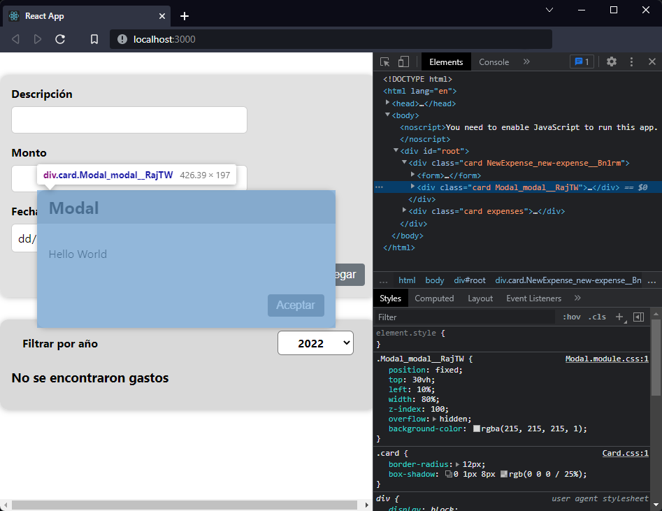
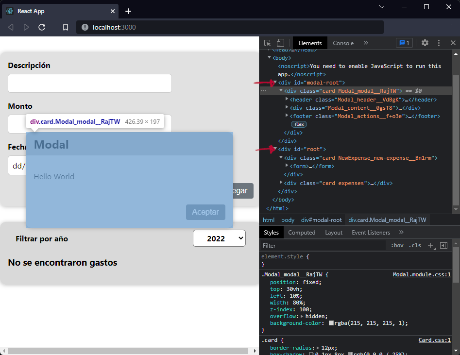

[`React`](../../README.md) > [`Sesión 04: Fragments, Portals y Refs`](../Readme.md) > `Ejemplo 02: React Portals`

---

## Ejemplo 02: React Portals

### Objetivos

- Renderizar elementos en un nodo del DOM que se encuentra afuera de la jerarquía del componente padre

### Desarrollo

En este ejemplo haremos un modal usando portales de React. Pero antes necesitamos crear un componente `Button` para evitar tener código duplicado. En la carpeta `src/UI` crea un archivo `Button.js` y `Button.module.css`:

**`Button.js`**:

```jsx
import styles from "./Button.module.css";

function Button(props) {
  return (
    <button
      className={styles.button}
      type={props.type || "button"}
      onClick={props.onClick}
    >
      {props.children}
    </button>
  );
}

export default Button;
```

**`Button.module.css`**:

```css
.button {
  color: #fff;
  background-color: #6c757d;
  border-color: #6c757d;
  border: 1px solid transparent;
  padding: 0.375rem 0.75rem;
  font-size: 1rem;
  border-radius: 0.25rem;
}

.button:hover {
  color: #fff;
  background-color: #5c636a;
  border-color: #565e64;
  cursor: pointer;
}

.button:focus {
  color: #fff;
  background-color: #5c636a;
  border-color: #565e64;
  box-shadow: 0 0 0 0.25rem rgb(130 138 145 / 50%);
}
```

Ahora en `NewExpense.module.css` puedes eliminar todas las clases del botón y en `NewForm.js` puedes cambiar el botón por este nuevo componente.

Teniendo este botón reutilizable podemos crear el componente para el modal. En la carpeta `src/UI` crea los archivos `Modal.js` y `Modal.module.css`.

**`Modal.js`**:

```jsx
import Card from "./Card";
import Button from "./Button";
import styles from "./Modal.module.css";

function Modal(props) {
  return (
    <Card className={styles.modal}>
      <header className={styles.header}>
        <h2>{props.title}</h2>
      </header>
      <div className={styles.content}>
        <p>{props.message}</p>
      </div>
      <footer className={styles.actions}>
        <Button onClick={props.onConfirm}>Aceptar</Button>
      </footer>
    </Card>
  );
}

export default Modal;
```

**`Modal.module.css`**:

```css
.modal {
  position: fixed;
  top: 30vh;
  left: 10%;
  width: 80%;
  z-index: 100;
  overflow: hidden;
  background-color: rgba(215, 215, 215, 1);
}

.header {
  background: #afafaf;
  padding: 0.5rem 1rem;
}

.header h2 {
  margin: 0;
  color: #000;
}

.content {
  padding: 1rem;
}

.actions {
  padding: 1rem;
  display: flex;
  justify-content: flex-end;
}

@media (min-width: 768px) {
  .modal {
    left: calc(50% - 20rem);
    width: 40rem;
  }
}
```

Hemos creado un componente para un modal y es lo suficientemente flexible para usarlo en distintas circunstancias ya que podemos cambiar el título y el contenido de manera dinámica mediante props.

En `ExpenseForm` vamos a crear una nueva variable de estado que se encargará de controlar cuándo se debe abrir el modal:

```jsx
const [isOpen, setIsOpen] = useState(true);
```

Por el momento lo vamos a inicializar en `true` para que salga el modal por defecto. También necesitamos una función _handler_ que cambie el valor de `isOpen`:

```jsx
const toggleModal = () => {
  setIsOpen(!isOpen);
};
```

Finalmente vamos a envolver el formulario en un fragmento para que podamos colocar el modal al mismo nivel del formulario. Revisaremos primero que `isOpen` sea `true` para poder renderizar el modal:

```jsx
{
  isOpen && (
    <Modal title="Modal" message="Hello World" onConfirm={toggleModal} />
  );
}
```



Con esto podemos ver el modal en cuanto inicia la aplicación. El único problema es que se está renderizando junto al formulario, lo correcto es que los elementos que sobresalen visualmente de su contenedor no formen parte de la jerarquía del nodo padre. Esto lo podemos corregir con un portal de React, primero debemos definir en dónde se va a renderizar el modal, agregaremos un nuevo `<div>` en `public/index.html`:

```html
<div id="modal-root"></div>
<div id="root"></div>
```

Para crear el portal usamos `ReactDOM.createPortal()`, el primer argumento es el componente y el segundo argumento el nodo donde se va a renderizar. Haremos los cambios en `Modal.js`:

```jsx
import ReactDOM from "react-dom";
import Card from "./Card";
import Button from "./Button";
import styles from "./Modal.module.css";

const ModalOverlay = (props) => (
  <Card className={styles.modal}>
    <header className={styles.header}>
      <h2>{props.title}</h2>
    </header>
    <div className={styles.content}>
      <p>{props.message}</p>
    </div>
    <footer className={styles.actions}>
      <Button onClick={props.onConfirm}>Aceptar</Button>
    </footer>
  </Card>
);

function Modal(props) {
  return ReactDOM.createPortal(
    <ModalOverlay
      title={props.title}
      message={props.message}
      onConfirm={props.onConfirm}
    />,
    document.getElementById("modal-root")
  );
}

export default Modal;
```

Para que sea más fácil de leer extraemos el componente `Modal` en la variable `ModalOverlay` y lo pasamos como primer argumento a `ReactDOM.createPortal()`. Con este cambio, el modal se renderiza fuera de la aplicación pese a que el componente lo usamos en `ExpenseForm`.


