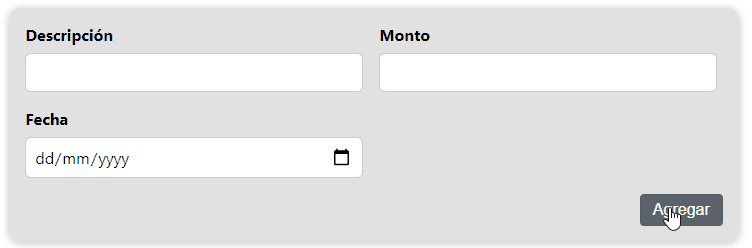

[`React`](../../README.md) > [`Sesión 04: Fragments, Portals y Refs`](../Readme.md) > `Ejemplo 03: useRef Hook`

---

## Ejemplo 03: useRef Hook

Vamos a usar el hook `useRef` para crear una referencia al input del título. Actualmente si intentamos agregar un nuevo gasto todos los inputs que estén vacíos cambian a rojo, adicionalmente, aprovecharemos el nuevo ref para enfocar el input del título.

Dentro de `ExpenseForm` lo primero es importar el hook:

```jsx
import React, { useState, useRef } from "react";
```

Ahora dentro del componente y antes de todas las variables de estado que tenemos vamos a crear un nuevo ref e inicializarlo con `null`:

```jsx
const titleRef = useRef(null);
```

Para _conectarlo_ con el input tenemos que agregar el atributo `ref` y pasarle `titleRef`:

```jsx
<input type="text" value={title} onChange={titleChangeHandler} ref={titleRef} />
```

Por último, dentro de nuestra condicional que revisa si el input se encuentra vacío llamaremos la función `focus()`:

```jsx
if (title.trim().length === 0) {
  setIsTitleValid(false);
  titleRef.current.focus();
}
```

Con esto, además de cambiar los estilos también se enfocará este input en caso de estar vacío.



Revisa el código completo de este componente con todos los cambios que llevamos hasta el momento:

```jsx
import React, { useState, useRef } from "react";
import Button from "../UI/Button";
import Modal from "../UI/Modal";
import styles from "./ExpenseForm.module.css";

function ExpenseForm(props) {
  const titleRef = useRef(null);
  const [title, setTitle] = useState("");
  const [amount, setAmount] = useState("");
  const [date, setDate] = useState("");
  const [isTitleValid, setIsTitleValid] = useState(true);
  const [isAmountValid, setIsAmountValid] = useState(true);
  const [isDateValid, setIsDateValid] = useState(true);
  const [error, setError] = useState(null);

  const titleChangeHandler = (event) => {
    const { value } = event.target;
    if (value.length > 0) setIsTitleValid(true);
    setTitle(value);
  };

  const amountChangeHandler = (event) => {
    const { value } = event.target;
    if (value.length > 0) setIsAmountValid(true);
    setAmount(value);
  };

  const dateChangeHandler = (event) => {
    const { value } = event.target;
    if (value.length > 0) setIsDateValid(true);
    if (new Date(value) > new Date()) {
      setIsDateValid(false);
      setError({
        title: "Fecha inválida",
        message: `La fecha no debe ser mayor a ${new Date().toLocaleDateString()}`,
      });
    }
    setDate(value);
  };

  const submitHandler = (event) => {
    event.preventDefault();

    validateFields();
    if (!(isTitleValid && isAmountValid && isDateValid)) return;

    const expense = {
      title,
      amount,
      date: new Date(date),
    };

    props.onSaveExpense(expense);

    setTitle("");
    setAmount("");
    setDate("");
  };

  const validateFields = () => {
    if (title.trim().length === 0) {
      setIsTitleValid(false);
      titleRef.current.focus();
    }

    if (amount.trim().length === 0) {
      setIsAmountValid(false);
    }

    if (date.trim().length === 0) {
      setIsDateValid(false);
    }
  };

  const errorHandler = () => {
    setError(null);
  };

  return (
    <React.Fragment>
      <form onSubmit={submitHandler}>
        <div className={styles["new-expense-controls"]}>
          <div
            className={`${styles["new-expense-control"]} ${
              !isTitleValid && styles.invalid
            }`}
          >
            <label>Descripción</label>
            <input
              type="text"
              value={title}
              onChange={titleChangeHandler}
              ref={titleRef}
            />
          </div>
          <div
            className={`${styles["new-expense-control"]} ${
              !isAmountValid && styles.invalid
            }`}
          >
            <label>Monto</label>
            <input
              type="number"
              min="1"
              step="1"
              value={amount}
              onChange={amountChangeHandler}
            />
          </div>
          <div
            className={`${styles["new-expense-control"]} ${
              !isDateValid && styles.invalid
            }`}
          >
            <label>Fecha</label>
            <input
              type="date"
              min="2019-01-01"
              value={date}
              onChange={dateChangeHandler}
            />
          </div>
        </div>
        <div className={styles["new-expense-actions"]}>
          <Button type="submit">Agregar</Button>
        </div>
      </form>
      {error && (
        <Modal
          title={error.title}
          message={error.message}
          onConfirm={errorHandler}
        />
      )}
    </React.Fragment>
  );
}

export default ExpenseForm;
```
