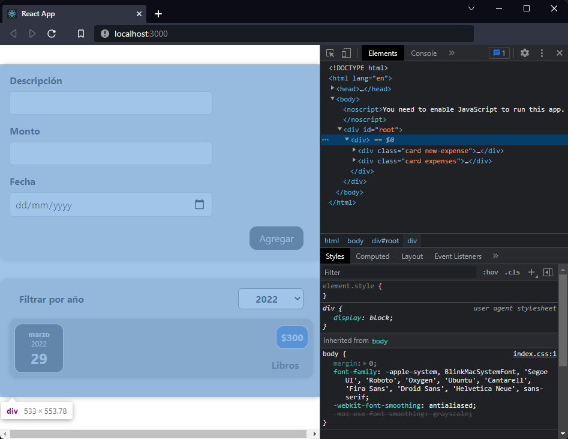

[`React`](../README.md) > `Sesión 04: Fragments, Portals y Refs`

---

# Sesión 04 - Fragments, Portals y Refs

## 🎯 Objetivos

- Renderizar elementos en un nodo del DOM que se encuentra afuera de la jerarquía del componente padre
- Obtener acceso a nodos del DOM o elementos de React creados en el método render

## 🛠 Contenido

### React Fragments

Hasta ahora hemos sido cuidadosos al crear nuestros componentes y hemos tratado de no retornar un `
` para envolver más de un elemento. Sin embargo, en nuestro componente `App` tuvimos que envolver los componentes `<NewExpense>` y `<Expenses>` en un `
`.

Aprovechemos para usar React Fragments y corregir este detalle.

- [`Ejemplo 01: React Fragments`](./Ejemplo-01/Readme.md)

### React Portals

Los portales nos permiten renderizar elementos en un nodo del DOM que se encuentra afuera de la jerarquía del componente padre, un buen ejemplo de uso son los componentes que sobresalen visualmente de su contenedor, por ejemplo, alertas, cuadros de diálogo, tooltips, o hovercards.

- [`Ejemplo 02: React portals`](./Ejemplo-02/Readme.md)
