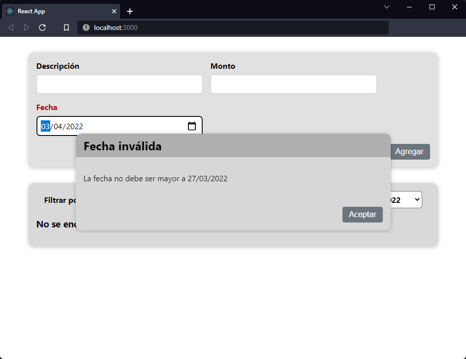

[`React`](../../README.md) > [`Sesión 04: Fragments, Portals y Refs`](../Readme.md) > `Reto 01: Error Modal`

---

## Reto 01: Error Modal

### Objetivos

- Crear un modal utilizando React Portals

### Desarrollo

1. Cambiar `isOpen` por `error`. Esta variable de estado será un objeto con las propiedades `title` y `message`.

2. Si el usuario selecciona una fecha mayor a la fecha actual abrir el modal con el título `Fecha inválida` y el mensaje `La fecha no debe ser mayor a [Fecha Actual]`.

3. Si la condición del punto dos se cumple cambiar los estilos del input de fecha para que reflejen el estado de error.

---

[Solución](./Solucion/Readme.md)
