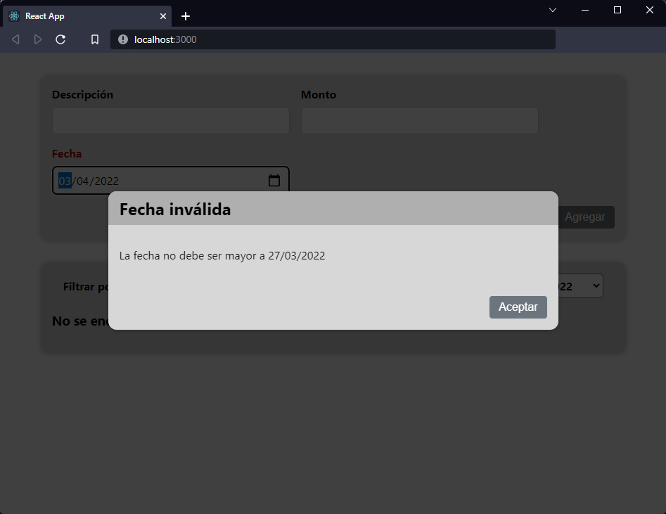

[`React`](../../README.md) > [`Sesión 04: Fragments, Portals y Refs`](../Readme.md) > `Reto 02: Backdrop`

---

## Reto 02: Backdrop

1. Usar los siguientes estilos para generar el backdrop:

```css
.backdrop {
  position: fixed;
  top: 0;
  left: 0;
  width: 100%;
  height: 100vh;
  z-index: 10;
  background: rgba(0, 0, 0, 0.75);
}
```

2. Crear un nuevo portal para el backdrop.

3. El backdrop debe mostrarse al mismo tiempo que el modal, si el usuario hace click en cualquier parte del backdrop el modal se debe cerrar.



---

[Solución](./Solucion/Readme.md)
