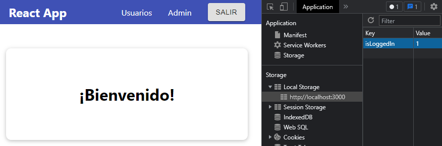

[`React`](../../README.md) > [`Sesión 05: Efectos Secundarios, Reducers y Context`](../Readme.md) > `Ejemplo 01: useEffect Hook`

---

## Ejemplo 01: useEffect Hook

Nuestro [Proyecto Inicial](../Proyecto-Inicial/) es un formulario de inicio de sesión, después de ingresar un correo y una contraseña nos lleva a un mensaje de bienvenida. En la barra de navegación las opciones `Usuarios` y `Admin` no hacen nada pero el botón `Salir` nos lleva de nuevo al formulario.

Todo esto lo logramos con el state dentro de `App`:

```jsx
const [isLoggedIn, setIsLoggedIn] = useState(false);
```

Si esta fuera una aplicación real no podríamos mantener la sesión activa porque al cargar de nuevo la página se inicializa la aplicación de nuevo y perdemos toda la información del estado. Afortunadamente contamos con varias opciones de persistencia de datos, vamos a implementar [localStorage](https://developer.mozilla.org/en-US/docs/Web/API/Window/localStorage) en nuestro proyecto para almacenar el valor de `isLoggedIn`:

```jsx
const loginHandler = (email, password) => {
  localStorage.setItem("isLoggedIn", "1");
  setIsLoggedIn(true);
};
```

Después de _iniciar sesión_ podemos inspeccionar la consola y ver que en efecto nuestra variable se ha guardado:



Sin embargo, si volvemos a cargar la página la aplicación nos lleva de nuevo al inicio de sesión aún a pesar de tener `isLoggedIn` guardado en `localStorage`. Con el hook `useEffect` podemos buscar el valor de `isLoggedIn` en cuanto se renderiza el componente.

```jsx
import React, { useState, useEffect } from "react";
import Login from "./components/Login/Login";
import Home from "./components/Home/Home";
import Header from "./components/Header/Header";

function App() {
  const [isLoggedIn, setIsLoggedIn] = useState(false);

  useEffect(() => {
    const isAuthenticated = localStorage.getItem("isLoggedIn");

    if (isAuthenticated === "1") {
      setIsLoggedIn(true);
    }
  }, []);

  const loginHandler = (email, password) => {
    localStorage.setItem("isLoggedIn", "1");
    setIsLoggedIn(true);
  };

  const logoutHandler = () => {
    setIsLoggedIn(false);
  };

  return (
    <React.Fragment>
      <Header isAuthenticated={isLoggedIn} onLogout={logoutHandler} />
      <main>
        {!isLoggedIn && <Login onLogin={loginHandler} />}
        {isLoggedIn && <Home onLogout={logoutHandler} />}
      </main>
    </React.Fragment>
  );
}

export default App;
```

Después de renderizar el componente React ejecuta la función que pasamos como primer argumento a `useEffect`. Aquí estamos buscando `isLoggedIn` en el `localStorage`, si lo encontramos y su valor es `'1'` actualizamos el state `isLoggedIn` a `true`. Recuerda que el segundo argumento de `useEffect` es un arreglo de dependencias, por defecto React ejecuta la función en cada renderizado pero si definimos dependencias React solo ejecuta la función cuando estas dependencias cambien. En este caso usamos un arreglo vacío, esto le indica a React que debe ejecutar la función una sola vez.

Ahora no importa cuántas veces recargues la página seguiremos viendo el mensaje de bienvenida. Para terminar vamos a eliminar la variable del `localStorage`:

```jsx
const logoutHandler = () => {
  localStorage.removeItem("isLoggedIn");
  setIsLoggedIn(false);
};
```

Ahora sí, hemos simulado un proceso de autenticación y al hacer click en el botón `Salir` borramos la información del `localStorage` y React nos lleva de nuevo al inicio de sesión.

> **Importante:** Recuerda que esta es una aplicación de ejemplo para revisar los conceptos de esta sesión, en un escenario real la función `loginHandler` debe comparar las credenciales del usuario con las que se encuentren en base de datos, usualmente mediante una petición HTTP.
