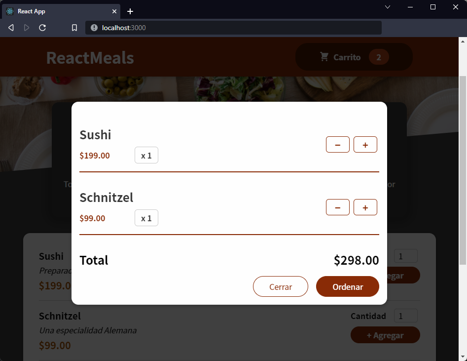

[`React`](../../README.md) > [`Sesión 05: Efectos Secundarios, Reducers y Context`](../Readme.md) > `Postwork`

---

# Postwork

## 🎯 Objetivos

- Manipular el state con lógica compleja mediante el uso del hook useReducer
- Pasar datos entre componentes sin enviar props en cada nivel

## 🛠 Desarrollo

Si has intentado manejar el state del carrito de compras seguro te habrás dado cuenta que es un state complejo especialmente porque distintos componentes necesitan la misma información. Ahora que ya sabes cómo usar los hooks useReducer y useContext puedes implementarlos en el proyecto.

Sigue las siguientes instrucciones:

- Crea `CartContext` (o el nombre que decidas) para ser usado como context del carrito de compras. Recuerda que necesitas poder guardar una lista de elementos, el total de elementos y las respectivas funciones para agregar o eliminar elementos.
- Utiliza `useReducer` para manejar el state del carrito de compras. Además de guardar la lista de elementos asegúrate de guardar el total de elementos.
- En la UI mostrar el total de platillos que se agregaron al carrito (antes de abrir el modal).
- En el modal debes mostrar la lista de platillos que se agregaron al carrito de compras y el total a pagar.
- El usuario debe poder cambiar las cantidades de cada platillo seleccionado desde el modal, al hacerlo el total se debe actualizar.

### Imágen de referencia

Recuerda que el diseño de la aplicación es a tu gusto, por lo que los colores y el acomodo de los elementos está completamente a tu criterio. A continuación te mostramos una imágen que te servirá como referencia de lo que llevamos hasta el momento:

