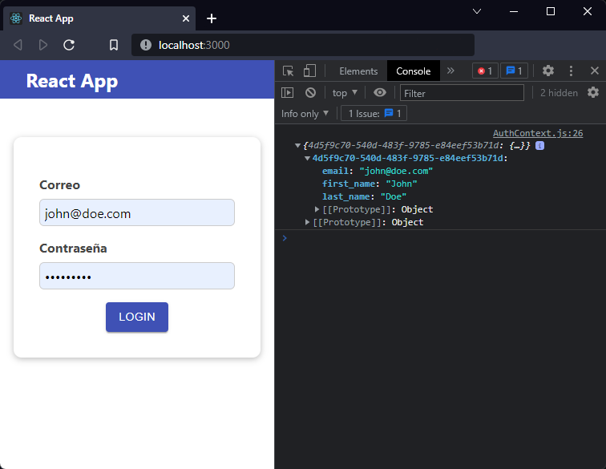
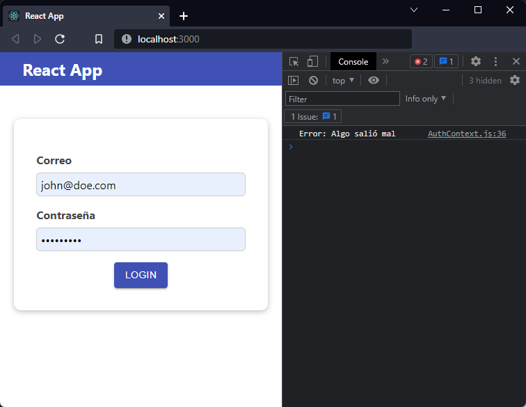

[`React`](../../README.md) > [`Sesión 06: Peticiones HTTP y Custom Hooks`](../Readme.md) > `Ejemplo 01: Fetch con React`

---

## Ejemplo 01: Fetch con React

### Objetivos

- Utilizar el método `fetch` para realizar peticiones HTTP

### Desarrollo

Vamos a continuar con nuestro formulario de autenticación de la sesión anterior. Ya que tenemos un usuario en la base de datos haremos una petición HTTP para obtener la información del usuario y simularemos un inicio de sesión.

> **Importante:** Lo que haremos en este ejemplo es para poder realizar peticiones HTTP con React y no representa un flujo de autenticación. En un escenario real debes tener en cuenta muchos otros factores como el encriptado de contraseñas y uso de tokens. Firebase también cuenta con servicio de autenticación que te permite empezar rápidamente ya que incluye procesos de verificación de correos y opciones para recuperar contraseñas, puedes consultar la documentación [aquí](https://firebase.google.com/docs/auth).

Como movimos la lógica de inicio de sesión y la pusimos en `AuthContext.js` aquí es donde haremos la petición HTTP. Primero vamos a crear una variable con la url que nos da Firebase.

```jsx
const BASE_URL = "https://react-http-bc6c7-default-rtdb.firebaseio.com/";
```

> **Nota:** Es buena práctica usar [variables de entorno](https://create-react-app.dev/docs/adding-custom-environment-variables/) en lugar de poner el valor en el código.

Ahora en la función `loginHandler` vamos comentar temporalmente el código que tenemos y agregaremos lo siguiente:

```jsx
const loginHandler = async (email) => {
  const url = `${BASE_URL}users.json?orderBy="email"&equalTo="${email}"`;
  const response = await fetch(url);
  const responseData = await response.json();
  console.log(responseData);
  //localStorage.setItem("isLoggedIn", "1");
  //setIsLoggedIn(true);
};
```

Como estamos haciendo una operación asíncrona cambiamos la función para poder usar `async/await`. La variable `url` contiene la url que nos proporciona firebase seguido del recurso que deseamos consumir, en este caso es `users.json`. Los parámetros que le siguen nos permiten filtrar por el correo del usuario. Puedes consultar más información sobre los filtros en Firebase [aquí](https://firebase.google.com/docs/database/rest/retrieve-data?authuser=0#section-rest-filtering).

Después de pasarle el `url` a `fetch()` este nos retorna una promesa que se resuelve en un objeto `Response`. Este objeto es una representación de la respuesta HTTP completa. Para extraer el contenido (body) de la respuesta usamos el método `json()`. Después de ingresar las credenciales y hacer click en `Login` podemos ver en consola los datos completos del usuario que tenemos en Firebase.



Para tener más control sobre esta operación que estamos haciendo con `fetch` vamos a crear otra función que se encargue exclusivamente de hacer la petición HTTP.

```jsx
const fetchUser = async (email) => {
  const url = `${BASE_URL}users.json?orderBy="email"&equalTo="${email}"`;
  const response = await fetch(url);
  return response.json();
};

const loginHandler = async (email) => {
  const user = await fetchUser(email);
  console.log(user);
  //localStorage.setItem("isLoggedIn", "1");
  //setIsLoggedIn(true);
};
```

El resultado es el mismo pero ahora es más fácil manejar errores. Por ejemplo, si `fetch` no retorna una respuesta exitosa podemos lanzar un error y controlarlo en `loginHandler` con un `try/catch`.

```jsx
const fetchUser = async (email) => {
  const url = `${BASE_URL}users.json?orderBy="email"&equalTo="${email}"`;
  const response = await fetch(url);

  if (!response.ok) throw new Error("Algo salió mal");

  return response.json();
};

const loginHandler = async (email) => {
  try {
    const user = await fetchUser(email);
    console.log(user);
  } catch (error) {
    console.log("Error:", error.message);
  }
  //localStorage.setItem("isLoggedIn", "1");
  //setIsLoggedIn(true);
};
```

Para simular un error cambia una letra de `BASE_URL`. Al momento de hacer la petición podemos ver nuestro mensaje de error en consola.



Deja `BASE_URL` como estaba, elimina `console.log(user)`, descomenta el código y ponlo dentro del `try/catch`. La aplicación debería volver a funcionar como en un principio.

```jsx
import React, { useState, useEffect } from "react";

const BASE_URL = "https://react-http-bc6c7-default-rtdb.firebaseio.com/";

const AuthContext = React.createContext({
  isLoggedIn: false,
  onLogout: () => {},
  onLogin: () => {},
});

export function AuthContextProvider(props) {
  const [isLoggedIn, setIsLoggedIn] = useState(false);

  useEffect(() => {
    const isAuthenticated = localStorage.getItem("isLoggedIn");

    if (isAuthenticated === "1") {
      setIsLoggedIn(true);
    }
  }, []);

  const fetchUser = async (email) => {
    const url = `${BASE_URL}users.json?orderBy="email"&equalTo="${email}"`;
    const response = await fetch(url);

    if (!response.ok) throw new Error("Algo salió mal");

    return response.json();
  };

  const loginHandler = async (email) => {
    try {
      const user = await fetchUser(email);

      localStorage.setItem("isLoggedIn", "1");
      setIsLoggedIn(true);
    } catch (error) {
      console.log("Error:", error.message);
    }
  };

  const logoutHandler = () => {
    localStorage.removeItem("isLoggedIn");
    setIsLoggedIn(false);
  };

  return (
    <AuthContext.Provider
      value={{
        isLoggedIn,
        onLogout: logoutHandler,
        onLogin: loginHandler,
      }}
    >
      {props.children}
    </AuthContext.Provider>
  );
}

export default AuthContext;
```
