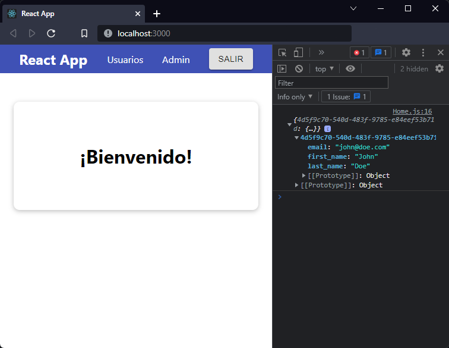
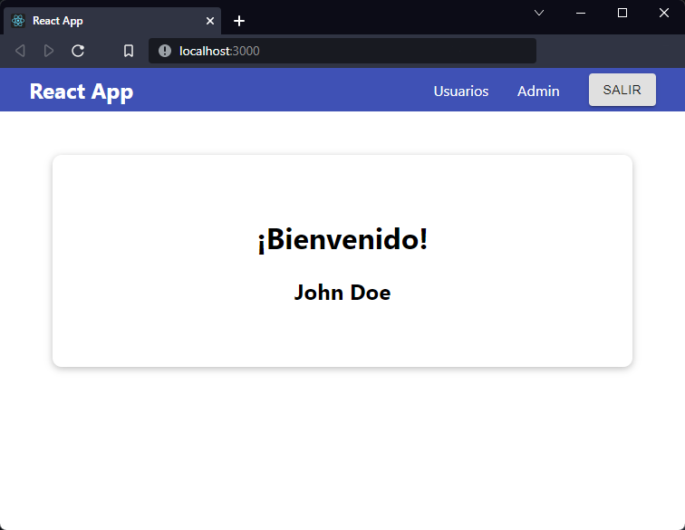

[`React`](../../README.md) > [`Sesión 06: Peticiones HTTP y Custom Hooks`](../Readme.md) > `Ejemplo 02: useEffect y fetch`

---

## Ejemplo 02: useEffect y fetch

Después de actualizar `isLoggedIn` estamos mostrando el componente `Home`. Por ahora sólo es un mensaje de bienvenida pero podemos aprovechar `useEffect` para mostrar más información del usuario.

Primero vamos a replicar lo que hicimos en el ejemplo anterior, como no estamos trabajando con variables de entorno necesitamos crear nuevamente `BASE_URL`, después usaremos `fetch` para traer la información del usuario desde Firebase, la diferencia es que esta vez lo haremos con el id que guardamos en `localStorage`.

```jsx
import { useEffect } from "react";
import Card from "../UI/Card/Card";
import styles from "./Home.module.css";

const BASE_URL = "https://react-http-bc6c7-default-rtdb.firebaseio.com/";

function Home() {
  useEffect(() => {
    const fetchUser = async () => {
      const userId = localStorage.getItem("userId");
      const url = `${BASE_URL}/users.json?orderBy="$key"&equalTo="${userId}"`;
      const response = await fetch(url);
      const responseData = await response.json();
      console.log(responseData);
    };

    fetchUser();
  }, []);

  return (
    <Card className={styles.home}>
      <h1>¡Bienvenido!</h1>
    </Card>
  );
}

export default Home;
```

Como el arreglo de dependencias está vacío, esta petición HTTP se va a realizar solo una vez al momento de cargar el componente. No podemos usar `async/await` en función de `useEffect`, es decir, esto no es correcto:

```jsx
useEffect(async () => {}, []);
```

Recuerda que la función de `useEffect` sólo puede retornar una función para ser usada como _cleanup_. Usar `async` de esa manera nos retornaría una promesa, es por eso que mejor creamos una función `fetchUser` y la llamamos dentro de `useEffect`.



Para poder trabajar con esta información del usuario necesitamos un nuevo state:

```jsx
const [user, setUser] = useState({
  first_name: "",
  last_name: "",
  email: "",
});
```

Ahora usemos `setUser` para actualizar el state:

```jsx
useEffect(() => {
  const fetchUser = async () => {
    const userId = localStorage.getItem("userId");
    const url = `${BASE_URL}/users.json?orderBy="$key"&equalTo="${userId}"`;
    const response = await fetch(url);
    const responseData = await response.json();

    setUser({
      first_name: responseData[userId].first_name,
      last_name: responseData[userId].last_name,
      email: responseData[userId].email,
    });
  };

  fetchUser();
}, []);
```

Listo, ya podemos usarlo en nuestro código JSX:

```jsx
import { useEffect, useState } from "react";
import Card from "../UI/Card/Card";
import styles from "./Home.module.css";

const BASE_URL = "https://react-http-bc6c7-default-rtdb.firebaseio.com/";

function Home() {
  const [user, setUser] = useState({
    first_name: "",
    last_name: "",
    email: "",
  });

  useEffect(() => {
    const fetchUser = async () => {
      const userId = localStorage.getItem("userId");
      const url = `${BASE_URL}/users.json?orderBy="$key"&equalTo="${userId}"`;
      const response = await fetch(url);
      const responseData = await response.json();

      setUser({
        first_name: responseData[userId].first_name,
        last_name: responseData[userId].last_name,
        email: responseData[userId].email,
      });
    };

    fetchUser();
  }, []);

  return (
    <Card className={styles.home}>
      <h1>¡Bienvenido!</h1>
      <h2>
        {user.first_name} {user.last_name}
      </h2>
    </Card>
  );
}

export default Home;
```


