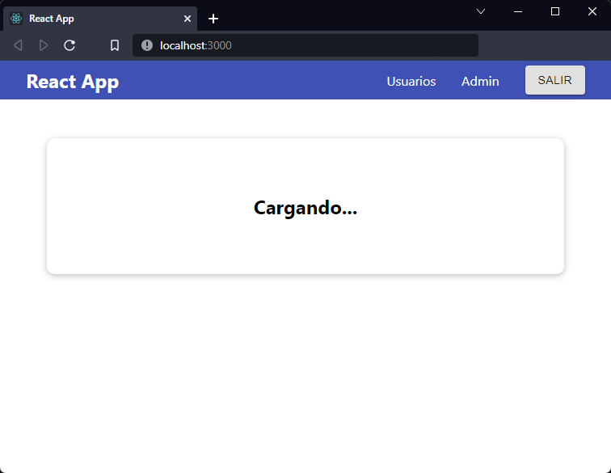
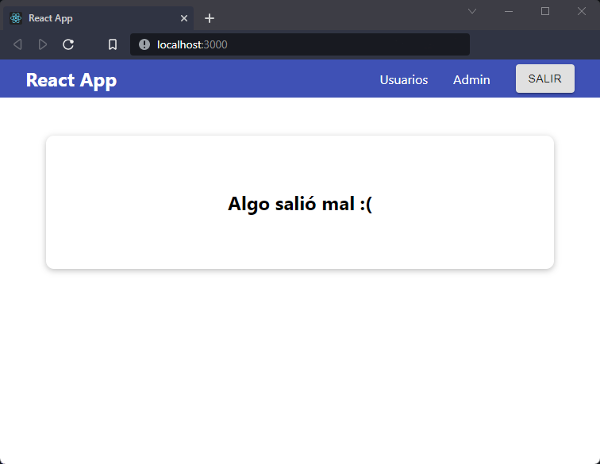

[`React`](../../README.md) > [`Sesión 06: Peticiones HTTP y Custom Hooks`](../Readme.md) > `Ejemplo 03: Manejo de errores y del estado de carga`

---

## Ejemplo 03: Manejo de errores y del estado de carga

Seguramente has notado en distintas páginas algún _spinner_ o elemento que indique que se está cargando la información. Vamos a integrar este _estado de carga_ en el componente `Home`. Empecemos con un nuevo state:

```jsx
const [isLoading, setIsLoading] = useState(true);
```

Estamos inicializando `isLoading` porque sabemos que vamos a hacer una petición HTTP al momento de renderizar el componente. Si necesitas mostrar este estado de carga después de alguna acción del usuario lo puedes inicializar en `false`. Cambiemos nuestro JSX para mostrar un mensaje diferente cuando `isLoading` sea `true`:

```jsx
return (
  <Card className={styles.home}>
    {!isLoading ? (
      <React.Fragment>
        <h1>¡Bienvenido!</h1>
        <h2>
          {user.first_name} {user.last_name}
        </h2>
      </React.Fragment>
    ) : (
      <h2>Cargando...</h2>
    )}
  </Card>
);
```

Por ahora sólo vamos a mostrar el mensaje `Cargando...` pero puedes usar alguna animación que refleje el mismo estado.



Sólo nos queda cambiar `isLoading` cuando la petición HTTP haya termiando.

```jsx
import React, { useEffect, useState } from "react";
import Card from "../UI/Card/Card";
import styles from "./Home.module.css";

const BASE_URL = "https://react-http-bc6c7-default-rtdb.firebaseio.com/";

function Home() {
  const [isLoading, setIsLoading] = useState(true);
  const [user, setUser] = useState({
    first_name: "",
    last_name: "",
    email: "",
  });

  useEffect(() => {
    const fetchUser = async () => {
      const userId = localStorage.getItem("userId");
      const url = `${BASE_URL}/users.json?orderBy="$key"&equalTo="${userId}"`;
      const response = await fetch(url);
      const responseData = await response.json();

      setUser({
        first_name: responseData[userId].first_name,
        last_name: responseData[userId].last_name,
        email: responseData[userId].email,
      });
      setIsLoading(false);
    };

    fetchUser();
  }, []);

  return (
    <Card className={styles.home}>
      {!isLoading ? (
        <React.Fragment>
          <h1>¡Bienvenido!</h1>
          <h2>
            {user.first_name} {user.last_name}
          </h2>
        </React.Fragment>
      ) : (
        <h2>Cargando...</h2>
      )}
    </Card>
  );
}

export default Home;
```

Por último, nos falta manejar cualquier error que suceda al momento de hacer la petición HTTP. Igual que con el estado de carga vamos a crear un nuevo estado:

```jsx
const [error, setError] = useState(null);
```

Ahora de manera muy similar a como lo hicimos anteriormente vamos a lanzar un error si `response.ok` es `false`:

```jsx
const fetchUser = async () => {
  const userId = localStorage.getItem("userId");
  const url = `${BASE_URL}/users.json?orderBy="$key"&equalTo="${userId}"`;
  const response = await fetch(url);

  if (!response.ok) throw new Error("Algo salió mal :(");

  const responseData = await response.json();

  setUser({
    first_name: responseData[userId].first_name,
    last_name: responseData[userId].last_name,
    email: responseData[userId].email,
  });
  setIsLoading(false);
};
```

Ahora con un `catch` podemos actualizar el estado de error:

```jsx
fetchUser().catch((error) => {
  setIsLoading(false);
  setError(error.message);
});
```

Separemos los mensajes de carga y de error para que sea más claro lo que estamos intentando hacer:

```jsx
const loadingMessage = <h2>Cargando...</h2>;

const errorMessage = <h2>{error}</h2>;

return (
  <Card className={styles.home}>
    {isLoading && loadingMessage}
    {error && errorMessage}
    {!isLoading && !error && (
      <React.Fragment>
        <h1>¡Bienvenido!</h1>
        <h2>
          {user.first_name} {user.last_name}
        </h2>
      </React.Fragment>
    )}
  </Card>
);
```

Ahora podemos mostrar al usuario mensajes distintos dependiendo del estado de nuestra aplicación, mostramos si estamos cargando la información, si ocurrió un error o si todo está en orden.



Este es el código final del componente `Home`:

```jsx
import React, { useEffect, useState } from "react";
import Card from "../UI/Card/Card";
import styles from "./Home.module.css";

const BASE_URL = "https://react-http-bc6c7-default-rtdb.firebaseio.com/";

function Home() {
  const [isLoading, setIsLoading] = useState(true);
  const [error, setError] = useState(null);
  const [user, setUser] = useState({
    first_name: "",
    last_name: "",
    email: "",
  });

  useEffect(() => {
    const fetchUser = async () => {
      const userId = localStorage.getItem("userId");
      const url = `${BASE_URL}/users.json?orderBy="$key"&equalTo="${userId}"`;
      const response = await fetch(url);

      if (!response.ok) throw new Error("Algo salió mal :(");

      const responseData = await response.json();

      setUser({
        first_name: responseData[userId].first_name,
        last_name: responseData[userId].last_name,
        email: responseData[userId].email,
      });
      setIsLoading(false);
    };

    fetchUser().catch((error) => {
      setIsLoading(false);
      setError(error.message);
    });
  }, []);

  const loadingMessage = <h2>Cargando...</h2>;

  const errorMessage = <h2>{error}</h2>;

  return (
    <Card className={styles.home}>
      {isLoading && loadingMessage}
      {error && errorMessage}
      {!isLoading && !error && (
        <React.Fragment>
          <h1>¡Bienvenido!</h1>
          <h2>
            {user.first_name} {user.last_name}
          </h2>
        </React.Fragment>
      )}
    </Card>
  );
}

export default Home;
```
