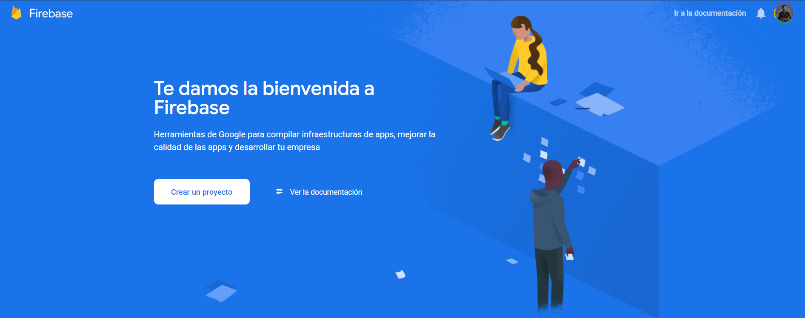
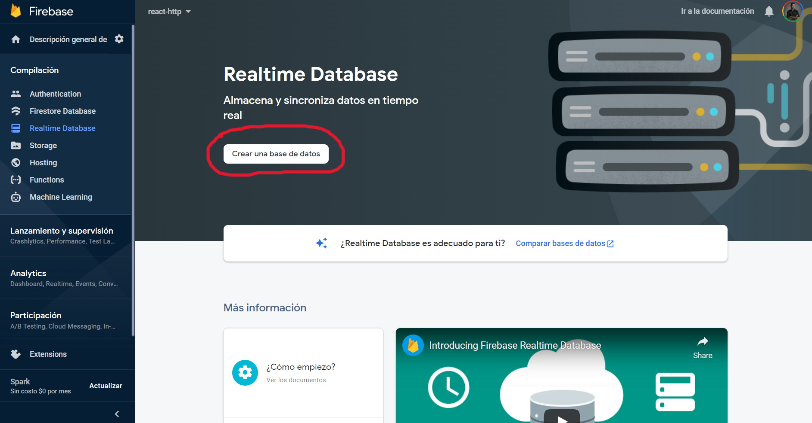
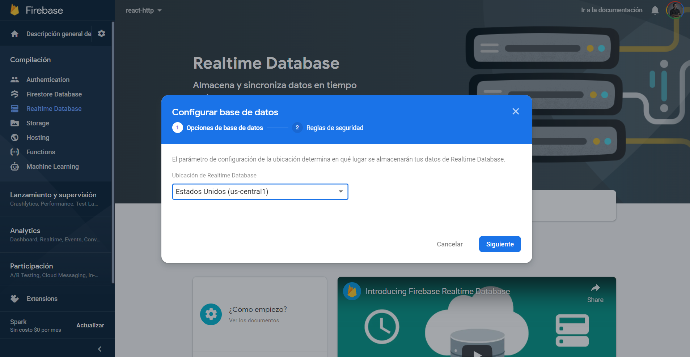
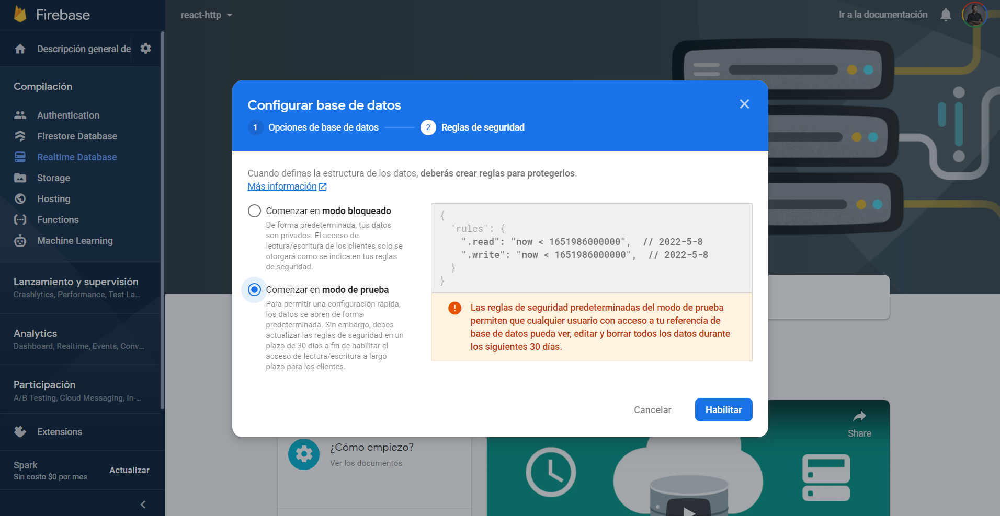
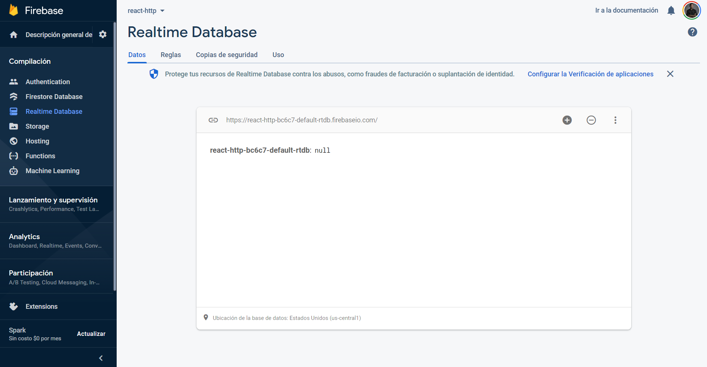
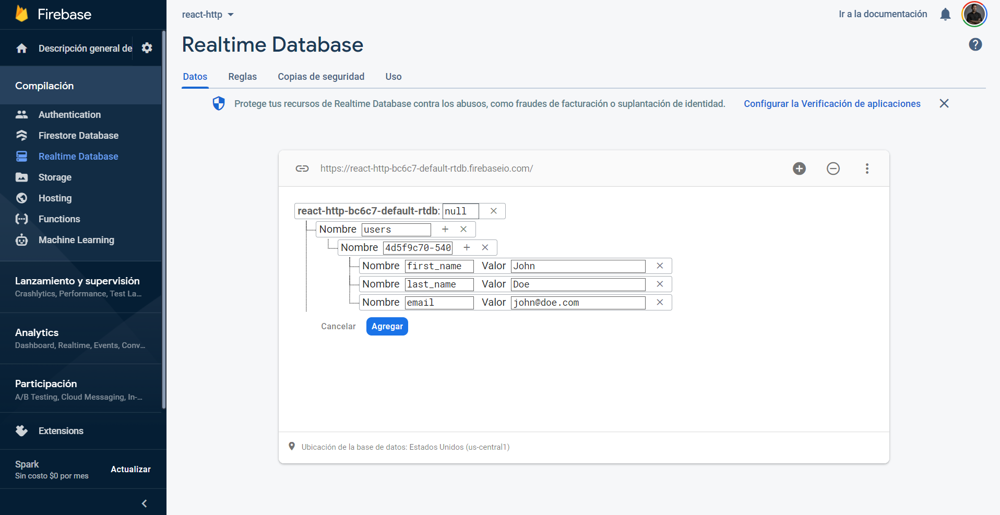
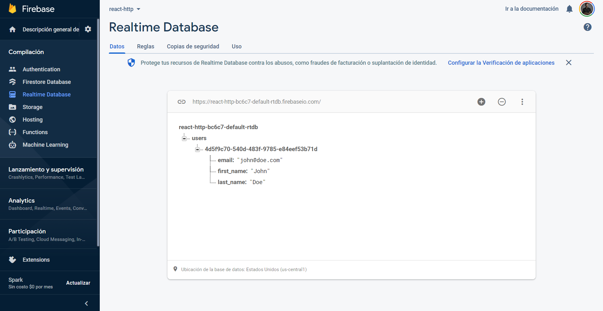
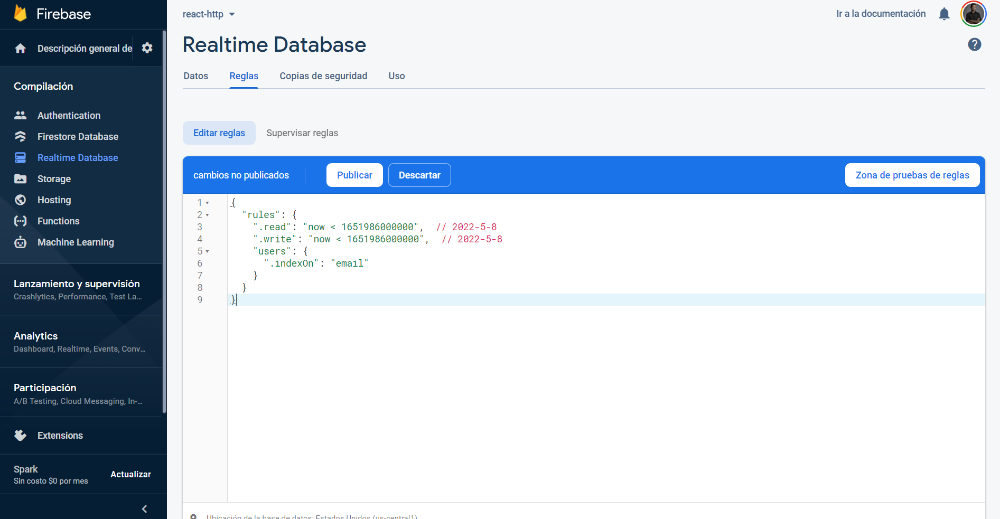

[`React`](../../README.md) > [`Sesión 06: Peticiones HTTP y Custom Hooks`](../Readme.md) > `Firebase`

---

## Firebase

Firebase es un servicio de Google de te permite crear bases de datos en tiempo real, también ofrece almacenamiento de datos y servicio de autenticación. Firebase es un buen complemento para aplicaciones nativas de Android, iOS, o incluso para aplicaciones Web.

En esta sesión nos enfocaremos en el servicio de base de datos para poder consumir recursos desde nuestra aplicación de React a través de peticiones HTTP. Usaremos este servicio porque es rápido de configurar y no requerimos de escribir código para crear una REST API. Puedes consultar la [documentación de Firebase aquí](https://firebase.google.com/docs) para conocer más a fondo cómo funciona y cuáles son todas sus fortalezas.

Sigue los siguientes pasos:

1. En tu navegador ve a la url [https://firebase.google.com/](https://firebase.google.com/).

2. Inicia sesión con tu cuenta de Google.

3. Haz click en `Crear un proyecto`.

4. Ingresa un nombre para el proyecto. En este caso usaremos `react-http`.

5. Desactiva la opción de `Google Analytics` y haz click en `Crear proyecto`.

6. Tardará unos segundos en crear el proyecto. Después de ver el mensaje de confirmación puedes hacer click en `Continuar`.

7. En el panel izquierdo haz click en `Realtime Database`.

8. Haz click en `Crear una base de datos`.

9. Selecciona la región en donde se encontrará tu base de datos y haz click en `Siguiente`.

10. Selecciona `Comenzar en modo de prueba` y haz click en `Habilitar`.

11. Verás un cuadro con la representación de la base de datos. En la parte superior encontrarás una url que usaremos más adelante para obtener los datos de la base de datos.

12. Puedes agregar datos como si se tratara de un objeto de JavaScript con pares de propiedades y valores. Agrega el valor `users`, debajo de este agrega un id ùnico, y debajo del id agrega los datos para el nombre, apellido y correo.

13. La estructura debe verse como la siguiente:

14. Por último, debemos agregar un índice para poder buscar por correo. Esto lo hacemos en la pestaña `Reglas`.

¡Listo! Ya podemos empezar a trabajar con esta base de datos.

> **Importante:** Lo que haremos en esta sesión no excederá los límites del plan gratuito. Puedes consultar más información [aquí](https://firebase.google.com/pricing).
