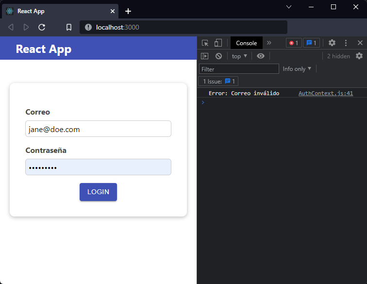
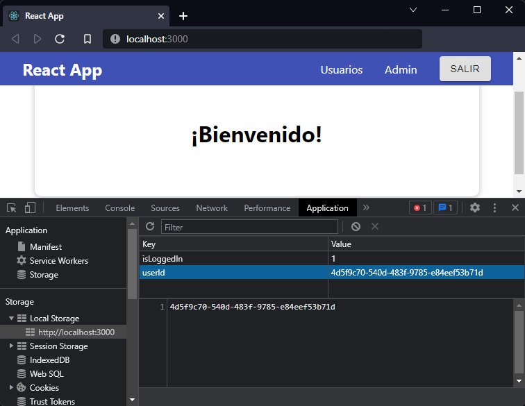

[`React`](../../README.md) > [`Sesión 06: Peticiones HTTP y Custom Hook`](../Readme.md) > `Reto 01: Peticiones HTTP`

---

## Reto 01: Peticiones HTTP

La aplicación funciona como la teníamos, la única diferencia es que puede tardar un poco más en cargar el mensaje de bienvenida, esta demora se debe al tiempo que tarda la petición HTTP en resolverse. Aún faltan detalles como validar que el correo sea válido y guardar el id del usuario para usarlo después.

1. Imprime en consola el mensaje `Correo inválido` si el usuario no existe.

2. Si el usuario es correcto guarda en `localStorage` el id del usuario y continúa con el flujo normal de la aplicación.

3. Elimina `userId` del `localStorage` al cerrar la sesión.

---

[Solución](./Solucion/Readme.md)
