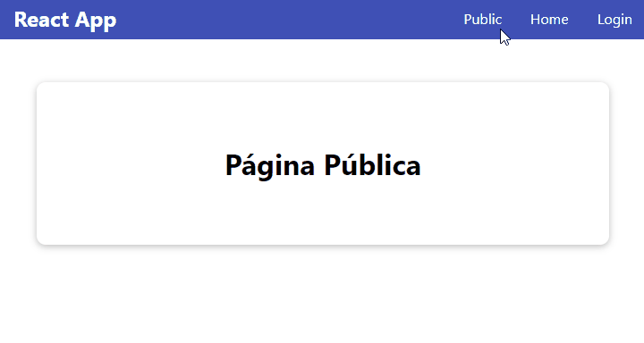

[`React`](../../README.md) > [`Sesión 07: React Router`](../Readme.md) > `Ejemplo 01: Rutas`

---

## Ejemplo 01: Rutas

### Objetivos

- Definir y utilizar rutas con React Router

### Desarrollo

Una vez instalado React Router lo primero que debemos hacer es envolver toda nuestra aplicación en el componente `<BrowserRouter>`, así todos los componentes de nuestra aplicación tendrán acceso a React Router. Este cambio lo hacemos en `src/index.js`:

```jsx
import ReactDOM from "react-dom";
import { BrowserRouter } from "react-router-dom";
import { AuthContextProvider } from "./context/AuthContext";
import App from "./App";
import "./index.css";

ReactDOM.render(
  <BrowserRouter>
    <AuthContextProvider>
      <App />
    </AuthContextProvider>
  </BrowserRouter>,
  document.getElementById("root")
);
```

Como en este ejemplo nos vamos a enfocar en definir, usar y cambiar rutas, vamos a ignorar temporalmente la lógica de autenticación que hicimos en las sesiones anteriores. Lo primero que haremos será crear un nuevo componente ya que usaremos tres rutas en total. En la carpeta `src/components` crea una nueva carpeta `Public` y dentro crea el archivo `Public.js`, agrega lo siguiente en ese archivo:

```jsx
import Card from "../UI/Card/Card";
import styles from "./Public.module.css";

function Public() {
  return (
    <Card className={styles.public}>
      <h1>Página Pública</h1>
    </Card>
  );
}

export default Public;
```

Es un componente sencillo que sólo muestra el mensaje `Página Pública` pero lo necesitamos para ver los cambios de rutas. Finalmente agrega los siguientes estilos en `src/components/Public/Public.module.css`:

```css
.public {
  width: 90%;
  max-width: 40rem;
  padding: 3rem;
  margin: 2rem auto;
  text-align: center;
}
```

Ahora bien, para definir rutas necesitamos usar los componentes `<Routes>` y `<Route>`, el primero solamente es para envolver los componentes que componen las rutas, el segundo es el que le dice a nuestra aplicación qué componente renderizar dependiendo de la ruta actual. Cambia el contenido de `App.js` por el siguiente:

```jsx
import React from "react";
import { Routes, Route } from "react-router-dom";
import Login from "./components/Login/Login";
import Home from "./components/Home/Home";
import Header from "./components/Header/Header";
import Public from "./components/Public/Public";

function App() {
  return (
    <React.Fragment>
      <Header />
      <main>
        <Routes>
          <Route path="/" element={<Public />} />
          <Route path="/home" element={<Home />} />
          <Route path="/login" element={<Login />} />
        </Routes>
      </main>
    </React.Fragment>
  );
}

export default App;
```

Acabamos de definir tres rutas distintas mediante el componente `<Route>` y el prop `path`, a cada ruta le corresponde un componente a renderizar el cual se define en el prop `element`. Para poder cambiar las rutas necesitamos cambiar el contenido de `Navigation.js` por el siguiente:

```jsx
import { Link } from "react-router-dom";
import styles from "./Navigation.module.css";

function Navigation() {
  return (
    <nav className={styles.nav}>
      <ul>
        <li>
          <Link to="/">Public</Link>
        </li>
        <li>
          <Link to="/home">Home</Link>
        </li>
        <li>
          <Link to="/login">Login</Link>
        </li>
      </ul>
    </nav>
  );
}

export default Navigation;
```

Si utilizamos el elemento `<a>` como teníamos anteriormente ocasionamos que el navegador haga una redirección lo que hace que se vuelva a cargar nuestra aplicación. El componente `<Link>` de React Router hace que el navegador no realice dicha redirección y después cambia la url. Con todo esto tenemos tres rutas que cargan tres componentes diferentes.


