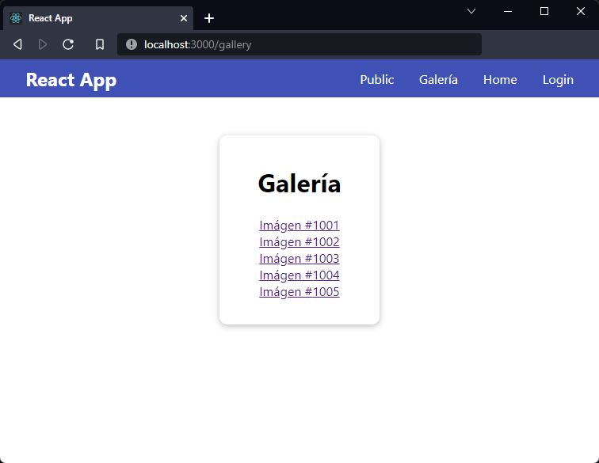
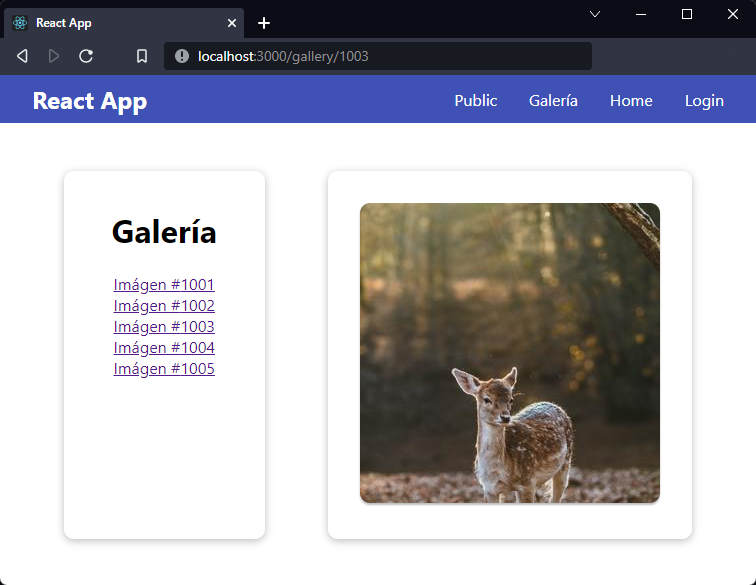

[`React`](../../README.md) > [`Sesión 07: React Router`](../Readme.md) > `Ejemplo 03: Parámetros de ruta`

---

## Ejemplo 03: Parámetros de ruta

Para ver cómo funcionan los parámetros de ruta crearemos un par de componentes nuevos y una ruta para mostrar una galería de imágenes. Para no descargar y agregar imágenes al proyecto usaremos el servicio [Lorem Picsum](https://picsum.photos/).

En la carpeta `src/components` crea una nueva carpeta `Gallery` y dentro crea cuatro archivos, `Gallery.js`, `Gallery.module.css`, `GalleryPicture.js`, y `GalleryPicture.module.css`. Agrega los siguientes estilos en los archivos css:

`Gallery.module.css`:

```css
.container {
  display: flex;
  justify-content: space-evenly;
  align-content: center;
}

.actions {
  display: flex;
  flex-direction: column;
}

.actions > :first-child {
  margin-bottom: 0.5rem;
}

.gallery {
  padding: 1rem 3rem;
  text-align: center;
}

.gallery ul {
  list-style: none;
  padding-left: 0;
}
```

`GalleryPicture.module.css`:

```css
.picture {
  padding: 2rem;
}

.picture img {
  box-shadow: 0 2px 2px rgb(0 0 0 / 26%);
  border-radius: 10px;
}
```

Veamos primero el componente `Gallery.js`. Este será un contenedor con una lista de imágenes, usaremos el componente `<Link>` de React Router porque queremos cambiar la url con el id de cada imágen.

```jsx
import { Routes, Route, Link } from "react-router-dom";
import Card from "../UI/Card/Card";
import styles from "./Gallery.module.css";

const pictureIds = [
  { id: 1001 },
  { id: 1002 },
  { id: 1003 },
  { id: 1004 },
  { id: 1005 },
];

function Gallery() {
  return (
    <div className={styles.container}>
      <Card className={styles.gallery}>
        <h1>Galería</h1>
        <ul>
          {pictureIds.map(({ id }) => (
            <li key={id}>
              <Link to={`${id}`}>Imágen #{id}</Link>
            </li>
          ))}
        </ul>
      </Card>
    </div>
  );
}

export default Gallery;
```

La lista de ids se escogieron aleatoriamente de [Lorem Picsum](https://picsum.photos/images). Para renderizar este componente primero vamos a agregar una nueva opción en nuestra barra de navegación, sólo tenemos que agregar un nuevo `<Link>` en `Navigation.js`:

```jsx
import { useContext } from "react";
import { Link } from "react-router-dom";
import AuthContext from "../../context/AuthContext";
import Button from "../UI/Button/Button";
import styles from "./Navigation.module.css";

function Navigation() {
  const { isLoggedIn, onLogout } = useContext(AuthContext);

  return (
    <nav className={styles.nav}>
      <ul>
        <li>
          <Link to="/">Public</Link>
        </li>
        <li>
          <Link to="/gallery">Galería</Link>
        </li>
        <li>
          <Link to="/home">Home</Link>
        </li>
        <li>
          {isLoggedIn ? (
            <Button color="secondary" onClick={onLogout}>
              Logout
            </Button>
          ) : (
            <Link to="/login">Login</Link>
          )}
        </li>
      </ul>
    </nav>
  );
}

export default Navigation;
```

Ahora debemos agregar esta nueva ruta en `App.js`:

```jsx
import React from "react";
import { Routes, Route } from "react-router-dom";
import RequireAuth from "./components/RequireAuth/RequireAuth";
import Login from "./components/Login/Login";
import Home from "./components/Home/Home";
import Header from "./components/Header/Header";
import Public from "./components/Public/Public";
import Gallery from "./components/Gallery/Gallery";

function App() {
  return (
    <React.Fragment>
      <Header />
      <main>
        <Routes>
          <Route path="/" element={<Public />} />
          <Route path="/login" element={<Login />} />
          <Route path="/gallery/*" element={<Gallery />} />
          <Route
            path="/home"
            element={
              <RequireAuth>
                <Home />
              </RequireAuth>
            }
          />
        </Routes>
      </main>
    </React.Fragment>
  );
}

export default App;
```

En esta ocasión tenemos que usar `/*` porque queremos que React Router renderice el componente `<Gallery>` con o sin parámetros, es decir, veremos el componente si la url es `/gallery` o `/gallery/1`.



Ahora vamos con el archivo `GalleryPicture.js`:

```jsx
import { useParams } from "react-router-dom";
import Card from "../UI/Card/Card";
import styles from "./GalleryPicture.module.css";

function GalleryPicture() {
  const { imageId } = useParams();

  const url = `https://picsum.photos/id/${imageId}/300/300`;

  return (
    <Card className={styles.picture}>
      
    </Card>
  );
}

export default GalleryPicture;
```

El hook `useParams` de React Router nos devuelve un objeto con todos los parámetros de la ruta actual. En este caso estamos extrayendo el parámetro `imageId` y lo estamos usando para armar la url que nos da la imagen de Lorem Picsum.

Finalmente debemos volver a `Gallery.js` y agregar un cambio más:

```jsx
import { Routes, Route, Link } from "react-router-dom";
import Card from "../UI/Card/Card";
import styles from "./Gallery.module.css";
import GalleryPicture from "./GalleryPicture";

const pictureIds = [
  { id: 1001 },
  { id: 1002 },
  { id: 1003 },
  { id: 1004 },
  { id: 1005 },
];

function Gallery() {
  return (
    <div className={styles.container}>
      <Card className={styles.gallery}>
        <h1>Galería</h1>
        <ul>
          {pictureIds.map(({ id }) => (
            <li key={id}>
              <Link to={`${id}`}>Imágen #{id}</Link>
            </li>
          ))}
        </ul>
      </Card>
      <Routes>
        <Route path=":imageId" element={<GalleryPicture />} />
      </Routes>
    </div>
  );
}

export default Gallery;
```

Nota cómo estamos usando nuevamente los componentes `<Routes>` y `<Route>` y cuando hacemos referencia a la ruta tanto en el prop `to` como en `path` no estamos empezando la ruta con `/`. Esto es porque estamos trabajando con una ruta anidada, es decir, cuando hagamos click en algún `<Link>` se va a agegar el id al final de la ruta actual. En `<Route>` estamos definiendo la variable `:imageId` la cual usamos para obtener la imagen como ya vimos en el componente `<GalleryPicture>`.


