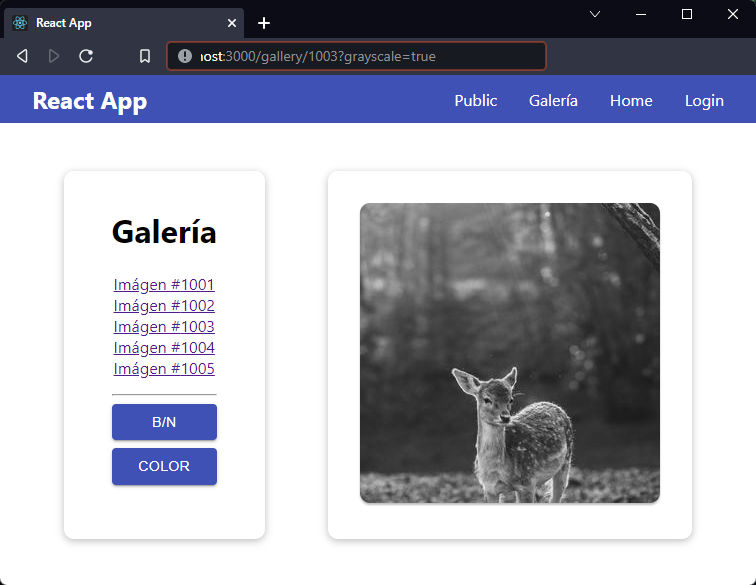

[`React`](../../README.md) > [`Sesión 07: React Router`](../Readme.md) > `Ejemplo 04: Parámetros de consulta`

---

## Ejemplo 04: Parámetros de consulta

### Objetivos

- Obtener parámetros de consulta con el hook useSearchParams

### Desarrollo

React Router también nos proporciona un hook para trabajar fácilmente con query params. Para demostrarlo haremos un par de ajustes a la ruta de la galería que ya tenemos para agregar el parámetro `grayscale`, con esto vamos a determinar si queremos la imagen en blanco y negro o en color.

Empezaremos agregando un par de botones en `Gallery.js`:

```jsx
import { Routes, Route, Link } from "react-router-dom";
import Button from "../UI/Button/Button";
import Card from "../UI/Card/Card";
import styles from "./Gallery.module.css";
import GalleryPicture from "./GalleryPicture";

const pictureIds = [
  { id: 1001 },
  { id: 1002 },
  { id: 1003 },
  { id: 1004 },
  { id: 1005 },
];

function Gallery() {
  return (
    <div className={styles.container}>
      <Card className={styles.gallery}>
        <h1>Galería</h1>
        <ul>
          {pictureIds.map(({ id }) => (
            <li key={id}>
              <Link to={`${id}`}>Imágen #{id}</Link>
            </li>
          ))}
        </ul>
        <hr />
        <div className={styles.actions}>
          <Button>B/N</Button>
          <Button>Color</Button>
        </div>
      </Card>
      <Routes>
        <Route path=":imageId" element={<GalleryPicture />} />
      </Routes>
    </div>
  );
}

export default Gallery;
```

Ahora importamos `useSearchParams` este es el hook que nos permite leer y modificar query strings en la url. Nos devuelve un arreglo con dos valores, los parámetros de consulta (search params) de la url actual y una función que nos sirve para actualizarlos, similar a como funciona el hook `useState`.

```jsx
import { Routes, Route, Link, useSearchParams } from "react-router-dom";
import Button from "../UI/Button/Button";
import Card from "../UI/Card/Card";
import styles from "./Gallery.module.css";
import GalleryPicture from "./GalleryPicture";

const pictureIds = [
  { id: 1001 },
  { id: 1002 },
  { id: 1003 },
  { id: 1004 },
  { id: 1005 },
];

function Gallery() {
  const [searchParams, setSearchParams] = useSearchParams();

  return (
    <div className={styles.container}>
      <Card className={styles.gallery}>
        <h1>Galería</h1>
        <ul>
          {pictureIds.map(({ id }) => (
            <li key={id}>
              <Link to={`${id}`}>Imágen #{id}</Link>
            </li>
          ))}
        </ul>
        <hr />
        <div className={styles.actions}>
          <Button onClick={() => setSearchParams({ grayscale: true })}>
            B/N
          </Button>
          <Button onClick={() => setSearchParams({ grayscale: false })}>
            Color
          </Button>
        </div>
      </Card>
      <Routes>
        <Route path=":imageId" element={<GalleryPicture />} />
      </Routes>
    </div>
  );
}

export default Gallery;
```

Por el momento no usaremos `searchParams`, pero en los botones estamos usando `setSearchParams` para agregar el parámetro `grayscale`. Al hacer click en los botones puedes ver cómo cambia la url y se agrega `?grayscale=` al final con el valor `true` o `false` dependiendo del botón en el que se hace click. Para leer y usar este nuevo parámetro debemos ir a `GalleryPicture.js`:

```jsx
import { useParams, useSearchParams } from "react-router-dom";
import Card from "../UI/Card/Card";
import styles from "./GalleryPicture.module.css";

function GalleryPicture() {
  const { imageId } = useParams();
  const [searchParams] = useSearchParams();
  const useGrayScale = searchParams.get("grayscale") === "true";

  const url = `https://picsum.photos/id/${imageId}/300/300${
    useGrayScale ? "?grayscale" : ""
  }`;

  return (
    <Card className={styles.picture}>
      
    </Card>
  );
}

export default GalleryPicture;
```

En esta ocasión sí estamos usando `searchParams`, además nos tenemos que apoyar del método `get()` para obtener el valor del parámetro que buscamos. Aunque nosotros estamos pasando un booleano en el componente `<Gallery>` aquí tenemos que usar `=== "true"` porque todos los valores de la url son cadenas de texto. Si revisamos la página de [Lorem Picsum](https://picsum.photos/) encontramos que para obtener una imagen en blanco y negro solamente debemos agregar el parámetro `?grayscale` al final de la url. Tomando esto en cuenta modificamos `url` para incluir dicho parámetro dependiendo del valor que le hayamos dado nosotros ya sea `true` o `false`.


