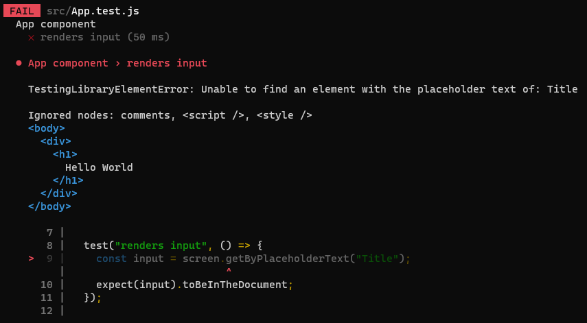
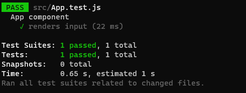
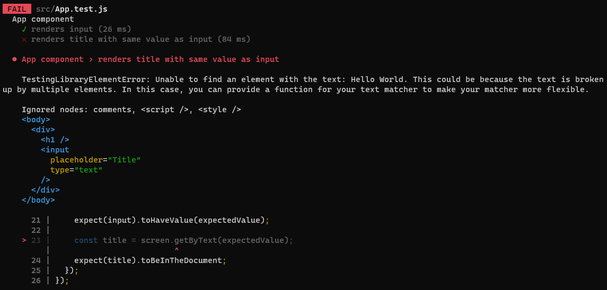
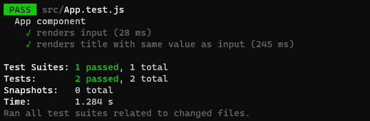

[`React`](../../README.md) > [`Sesión 08: Unit Testing en React`](../Readme.md) > `Ejemplo 01: Interacciones de usuario`

---

## Ejemplo 01: Interacciones de usuario

### Objetivos

- Simular interacciones de usuario en pruebas unitarias

### Desarrollo

Cuando pensamos en TDD debemos primero construir un test basado en una característica, por ejemplo, _como usuario quiero poder cambiar el título utilizando un input de tipo texto_. Haremos un test para validar este escenario y después construiremos el componente adecuado. En `App.test.js` empezaremos importando lo siguiente:

```jsx
import { render, screen } from "@testing-library/react";
import userEvent from "@testing-library/user-event";
import App from "./App";
```

El método `render` nos permitirá renderizar internamente el componente `App`. Decimos internamente porque no lo veremos en el navegador, React Testing Library simulará un navegador para renderizar `App`. Después usaremos `userEvent` para simular interacciones o eventos del usuario. Lo siguiente será agrupar los tests usando `describe`:

```jsx
import { render, screen } from "@testing-library/react";
import userEvent from "@testing-library/user-event";
import App from "./App";

describe("App component", () => {});
```

Empecemos con un test sencillo, validar que se está renderizando el input.

```jsx
import { render, screen } from "@testing-library/react";
import userEvent from "@testing-library/user-event";
import App from "./App";

describe("App component", () => {
  test("renders input", () => {
    render(<App />);

    const input = screen.getByPlaceholderText("Title");
    expect(input).toBeInTheDocument;
  });
});
```

Tenemos varias formas de seleccionar un elemento del DOM, cuando se trata de un `input` podemos usar `getByLabelText` cuando el `input` está vinculado a un `label`. Otra opción es `getByPlaceholderText` cuando el `input` tiene el atributo `placeholder`.

Ahora si ejecutamos `npm run test` la prueba debería fallar porque en el DOM no existe ningún `input`:



Regresemos a `App` y agregemos el `input` que necesitamos.

```jsx
import React from "react";

function App() {
  return (
    <React.Fragment>
      <h1>Hello World</h1>
      <input type="text" placeholder="Title" />
    </React.Fragment>
  );
}

export default App;
```

Con este cambio nuestro test ya debería pasar.



El siguiente test que haremos es más complejo, queremos evaluar que el título que se está renderizando en el DOM es igual al valor del input que acabamos de agregar. Vamos a descomponer este test en tres partes:

1. Validar que el `input` se está renderizando y no tiene valor.
2. Simular que el usuario llena el `input` y su valor cambia.
3. Validar que el título tiene el mismo valor que el `input`.

```jsx
import { render, screen } from "@testing-library/react";
import userEvent from "@testing-library/user-event";
import App from "./App";

describe("App component", () => {
  beforeEach(() => render(<App />));

  test("renders input", () => {
    const input = screen.getByPlaceholderText("Title");
    expect(input).toBeInTheDocument;
  });

  test("renders title with same value as input", () => {
    const input = screen.getByPlaceholderText("Title");
    expect(input).toBeInTheDocument;
    expect(input).toHaveValue("");
  });
});
```

Antes de empezar movimos el método `render` dentro de `beforeEach`, de esta manera no tenemos que llamar `render` en cada test. La siguiente parte del test es simular que el usuario llena el `input`, esto lo podemos hacer con `userEvent.type` el cual recibe dos argumentos, el nodo en el que se va a ejecutar el evento y el texto que se va a ingresar.

```jsx
import { render, screen } from "@testing-library/react";
import userEvent from "@testing-library/user-event";
import App from "./App";

describe("App component", () => {
  beforeEach(() => render(<App />));

  test("renders input", () => {
    const input = screen.getByPlaceholderText("Title");
    expect(input).toBeInTheDocument;
  });

  test("renders title with same value as input", () => {
    const expectedValue = "Hello World";

    const input = screen.getByPlaceholderText("Title");
    expect(input).toBeInTheDocument;
    expect(input).toHaveValue("");

    userEvent.type(input, expectedValue);
    expect(input).toHaveValue(expectedValue);
  });
});
```

Como primero validamos que el valor del `input` sea un string vacío es bueno validar que el valor haya cambiado después de simular la interacción del usuario. Para no repetir el mismo string varias veces lo guardamos en la variable `expectedValue`. Por último, debemos validar que el título se haya renderizado y tenga el mismo valor del `input`.

```jsx
import { render, screen } from "@testing-library/react";
import userEvent from "@testing-library/user-event";
import App from "./App";

describe("App component", () => {
  beforeEach(() => render(<App />));

  test("renders input", () => {
    const input = screen.getByPlaceholderText("Title");
    expect(input).toBeInTheDocument;
  });

  test("renders title with same value as input", () => {
    const expectedValue = "Hello World";

    const input = screen.getByPlaceholderText("Title");
    expect(input).toBeInTheDocument;
    expect(input).toHaveValue("");

    userEvent.type(input, expectedValue);
    expect(input).toHaveValue(expectedValue);

    const title = screen.getByText(expectedValue);
    expect(title).toBeInTheDocument;
  });
});
```

Este segundo test debe fallar cuando queremos evaluar que el título haya cambiado. En las dos primeras partes no va a fallar porque es el `input` tiene su propio estado cuyo valor se actualiza correctamente.



Para completar este test debemos agregar estado al componente `App` junto con un handler que lo actualice.

```jsx
import React, { useState } from "react";

function App() {
  const [text, setText] = useState("");

  const changeHandler = (event) => setText(event.target.value);

  return (
    <React.Fragment>
      <h1>{text}</h1>
      <input
        type="text"
        placeholder="Title"
        value={text}
        onChange={changeHandler}
      />
    </React.Fragment>
  );
}

export default App;
```

Listo, ahora el título es dinámico, comparte el mismo valor del `input` y se actualiza cuando el usuario cambia su valor. Este cambio se refleja en nuestros tests:


