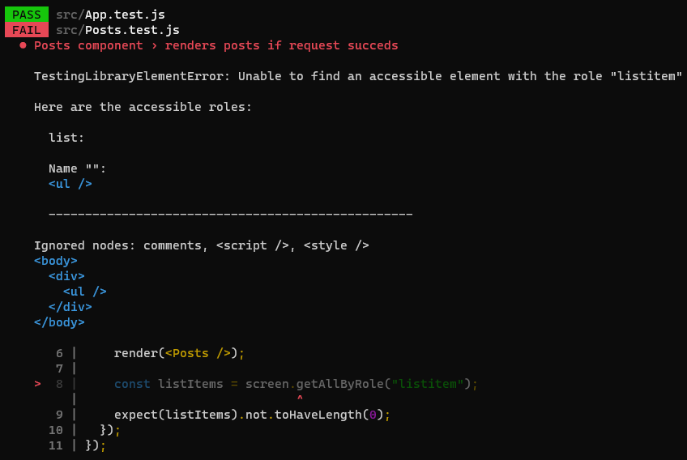
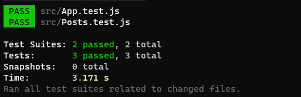

[`React`](../../README.md) > [`Sesión 08: Unit Testing en React`](../Readme.md) > `Ejemplo 02: Testing asíncrono`

---

## Ejemplo 02: Testing asíncrono

Para este ejemplo usaremos la API [JSON Placeholder](https://jsonplaceholder.typicode.com/). Esta API es gratuita y perfecta para hacer pruebas o prototipos, contiene varios endpoints para obtener información de muestra, el que usaremos será `/posts`, el cual retorna un arreglo de publicaciones o posts con la siguiente estructura:

```json
[
  {
    "userId": 1,
    "id": 1,
    "title": "sunt aut facere repellat provident occaecati excepturi optio reprehenderit",
    "body": "quia et suscipit\nsuscipit recusandae consequuntur expedita et cum\nreprehenderit molestiae ut ut quas totam\nnostrum rerum est autem sunt rem eveniet architecto"
  }
]
```

Empecemos creando un nuevo archivo `Posts.js`, aquí vamos a renderizar una lista sencilla, recuerda que no nos estamos enfocando en estilos durante esta sesión.

```jsx
import { useEffect, useState } from "react";

function Posts() {
  const [posts, setPosts] = useState([]);

  return (
    <ul>
      {posts.map((post) => (
        <li key={post.id}>{post.title}</li>
      ))}
    </ul>
  );
}

export default Posts;
```

Ahora utilizaremos `fetch` para hacer la petición HTTP a la API.

```jsx
import { useEffect, useState } from "react";

function Posts() {
  const [posts, setPosts] = useState([]);

  useEffect(() => {
    fetch("https://jsonplaceholder.typicode.com/posts")
      .then((response) => response.json())
      .then((data) => setPosts(data));
  }, []);

  return (
    <ul>
      {posts.map((post) => (
        <li key={post.id}>{post.title}</li>
      ))}
    </ul>
  );
}

export default Posts;
```

Para el test necesitamos el archivo `Posts.test.js` y podemos empezar con lo que ya sabemos, importar `render`, `screen`, y el componente `Posts`. Después agrupar los tests usando `describe` y por último crear un test para validar que la lista no se encuentra vacía, para esto podemos usar `getAllByRole`.

```jsx
import { render, screen } from "@testing-library/react";
import Posts from "./Posts";

describe("Posts component", () => {
  test("renders posts if request succeds", () => {
    render(<Posts />);

    const listItems = screen.getAllByRole("listitem");
    expect(listItems).not.toHaveLength(0);
  });
});
```

En esta ocasión no hicimos TDD pero aún así nuestro test está fallando.



Esto es porque la lista se renderiza después de realizar la petición HTTP, esto es una operación asíncrona por lo que podría demorar unos milisegundos. Al momento de ejecutar `getAllByRole` la lista aún no existe, después de unos milisegundos la lista se renderiza pero el código de nuestro test ya terminó de ejecutar.

React Testing Library cuenta con dos grupos de métodos para seleccionar elementos, los que empiezan con `get` que ya hemos utilizado y los que empiezan con `find`. La diferencia es que todos los métodos que empiezan con `find` retornan una promesa.

```jsx
import { render, screen } from "@testing-library/react";
import Posts from "./Posts";

describe("Posts component", () => {
  test("renders posts if request succeds", async () => {
    render(<Posts />);

    const listItems = await screen.findAllByRole("listitem");
    expect(listItems).not.toHaveLength(0);
  });
});
```

Como estamos trabajando con promesas podemos cambiar la función del test por una función `async/await`. El método `findAllByRole` espera un segundo antes de buscar en el DOM el elemento que estamos pidiendo y es posible aumentar o disminuir este tiempo.

Ahora que estamos usando `await` el tiempo de espera es suficiente para que la petición a la API se resuelva y se renderice la lista.


