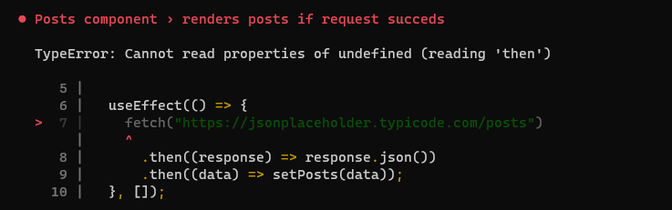
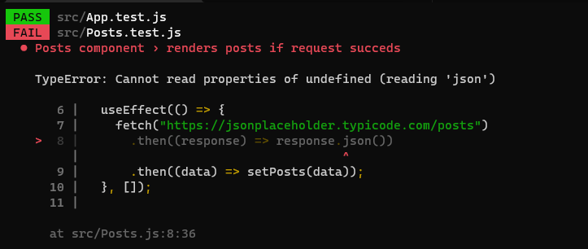
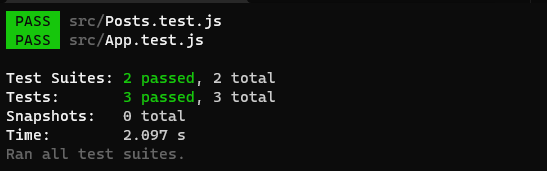

[`React`](../../README.md) > [`Sesión 08: Unit Testing en React`](../Readme.md) > `Ejemplo 03: Mocks`

---

## Ejemplo 03: Mocks

Para evitar que `fetch` haga la petición HTTP a la API debemos reemplazar `fetch` por una función mock antes de renderizar el componente `Posts`. Recuerda que `fetch` es un método global, es decir, se encuentra dentro del objeto `window`.

```jsx
import { render, screen } from "@testing-library/react";
import Posts from "./Posts";

describe("Posts component", () => {
  test("renders posts if request succeds", async () => {
    window.fetch = jest.fn();

    render(<Posts />);

    const listItems = await screen.findAllByRole("listitem");
    expect(listItems).not.toHaveLength(0);
  });
});
```

`jest.fn()` retorna una función mock. Esta es una función vacía con varios métodos que nos ayudarán a _manipular_ el comportamiento de `fetch`. Si ejecutamos este test vemos un error que nos indica que no se está enviando la petición HTTP, de hecho, nos dice que `fetch` no está retornando nada.



Si bien ya no estamos haciendo la llamada a la API aún nos hace falta simular el comportamiento de `fetch`. Por cómo lo hemos estado usando sabemos que `fetch` retorna una promesa que se resuelve en un Response. Podemos usar el método `mockResolvedValueOnce` que incluyen todos los mocks, esta función nos permite resolver una promesa con el valor que le indiquemos.

```jsx
import { render, screen } from "@testing-library/react";
import Posts from "./Posts";

describe("Posts component", () => {
  test("renders posts if request succeds", async () => {
    window.fetch = jest.fn();
    window.fetch.mockResolvedValueOnce();

    render(<Posts />);

    const listItems = await screen.findAllByRole("listitem");
    expect(listItems).not.toHaveLength(0);
  });
});
```

Ahora cuando el componente llame `fetch` no se hará la petición HTTP pero sí se resolverá una promesa, aún nos falta definir el valor que resuelve dicha promesa por lo que veremos un error como el siguiente:



Esto nos indica que sí obtuvimos `response` pero que se encuentra `undefined`. Por la implementación que tenemos sabemos que `response` es un objeto con un método `json`, este método también retorna una promesa que resuelve en la información de la API, en nuestro caso se resuelve en una publicación.

```jsx
import { render, screen } from "@testing-library/react";
import Posts from "./Posts";

describe("Posts component", () => {
  test("renders posts if request succeds", async () => {
    window.fetch = jest.fn();
    window.fetch.mockResolvedValueOnce({
      json: async () => [
        {
          userId: 1,
          id: 1,
          title: "Fake Title",
          body: "Fake Body",
        },
      ],
    });

    render(<Posts />);

    const listItems = await screen.findAllByRole("listitem");
    expect(listItems).not.toHaveLength(0);
  });
});
```

No es necesario que simulemos toda la implementación de `fetch`, con simular los métodos que usamos en el código es suficiente. En este caso solo se necesita retornar un objeto con el método `json` para obtener una publicación como la que nos manda la API que estamos usando.

Con estos cambios seguimos evaluando que la lista de publicaciones se renderiza correctamente sin hacer peticiones HTTP a la API.


