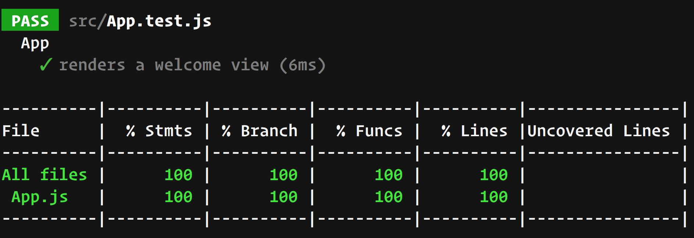

[`React`](../../README.md) > [`Sesión 08: Unit Testing en React`](../Readme.md) > `Postwork`

---

# Postwork

## 🎯 Objetivos

- Crear pruebas unitarias para componentes de React
- Utilizar Mocks para simular funciones y/o módulos

## 🛠 Desarrollo

En este punto tu aplicación debería estar completa en cuanto a funcionalidad. Como desarrollador es importante que siempre incluyas unit testing en todos tus proyectos sin importar el tamaño, especialmente ahora que estás empezando a pulir tus habilidades como desarrollador.

Jest tiene integrado un reporte de cobertura, este indica qué tanto del código se encuentra cubierto por las pruebas unitarias. Para ver el reporte puedes ejecutar el siguiente comando:

`npm test -- --coverage`

Después de ejecutar todas las pruebas verás una tabla como la siguiente:

Lo ideal es una cobertura del 100% pero esto varía mucho dependiendo del equipo de trabajo, algunos equipos buscan estar cerca del 90% o 95%. No es muy común ver coberturas debajo del 80% y el indicador más usado es **Branch Coverage**, este nos indica qué tantos caminos posibles están siendo evaluados, si tienes una condicional este indicador revisa si ambos casos están cubiertos.

Sigue las siguientes instrucciones:

- Si anteriormente borraste el archivo `setupTests.js` agrégalo de nuevo a tu proyecto. Este archivo importa herramientas de Jest como los matchers que se usaron durante la sesión.
- Utiliza mocks para evitar hacer peticiones HTTP. Si estás usando alguna librería como Axios consulta la documentación de Jest ya que hay formas de hacer un mock de módulos completos.
- Enfócate primero en pruebas sencillas como componentes de presentación, es decir, componentes que no tienen lógica compleja y sólo renderizan elementos en el DOM.
- Después empieza agregar pruebas a los escenarios que involucran interacciones de usuario, por ejemplo, clics de botón o cambios en un input.
- Cuando tengas las pruebas del _happy path_, es decir, el escenario en el que todo sale correctamente, agrega pruebas para evaluar el caso opuesto, por ejemplo, cuando falla una petición HTTP.
- Tu proyecto debe contar mínimo con un 80% de branch coverage.
