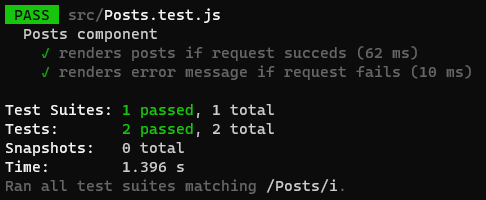

[`React`](../../README.md) > [`Sesión 08: Unit Testing en React`](../Readme.md) > `Reto 01: Mock de errores`

---

## Reto 01: Mock de errores

En la sesión anterior hicimos un mock de `fetch` para simular una petición HTTP. Ese test se considera como el _happy path_ que es cuando todo sale como se espera. Nos hace falta un test para validar el comportamiento de la aplicación cuando las cosas no salen como se espera.

1. Crea un nuevo test y haz un mock de `fetch`.
2. El mock debe rechazar la promesa y lanzar un error.
3. Valida que se está renderizando el mensaje de error.
4. Valida que la lista no se renderizó.
5. Cambia el código para que este test pueda pasar exitosamente.

---

[Solución](./Solucion/Readme.md)
