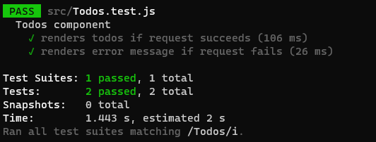

[`React`](../../README.md) > [`Sesión 08: Unit Testing en React`](../Readme.md) > `Reto 02: Mock e interacciones`

---

## Reto 02: Mock e interacciones

### Objetivos

- Implementar TDD para construir un componente de React
- Utilizar mocks para simular el método `fetch`

### Desarrollo

Para este reto pondrás en práctica tanto los mocks como las interacciones de usuario. Es necesario crear dos archivos nuevos `Todos.js` y `Todos.test.js`. Para este nuevo componente usarás el mismo API que usamos anteriormente pero cambiaremos el endpoint para usar `/todos`.

1. El primer test será para evaluar que la lista de `todos` se renderiza correctamente. La llamada a la API será con la interacción del usuario, es decir, el componente `<Todo/>` tendrá un botón que al hacer click hará una petición HTTP a la API, cuando esta petición se resuelva se renderiza la lista.

2. El segundo test será para el caso en el que la petición o llamada a la API falla. En lugar de renderizar una lista se debe renderizar el mensaje de error que nos retorna `fetch`.

3. Construye el componente de tal forma que cumpla las características mencionadas y los tests sean válidos.

---

[Solución](./Solucion/Readme.md)
